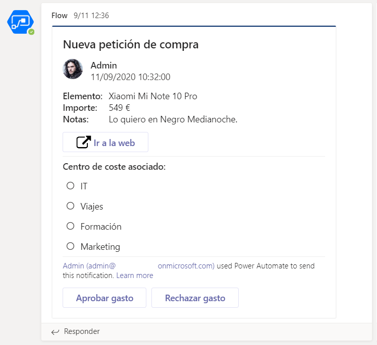

# Creación de un conector de Teams a través de Adaptive Cards y Power Automate

## Introducción

Si has llegado hasta aquí, enhorabuena. Has podido ver lo desafiante que es el ecosistema de Microsoft 365 para hacer integrar toda las operaciones. Ahora bien, ¿por qué complicarnos tanto si podemos hacerlo de una forma mucho más sencilla con las Adaptive Cards, que son su evolución natural? Para ello sólo necesitaremos de Power Automate.

## Qué son las Adaptive Cards

Las Adaptive Cards son otro tipo de tarjetas que permiten enviar información a los usuarios en canales o chat privados y, además, les permite interactuar con ellas a través del Bot de Flow:

Si queréis saber cómo funcionan y qué se pueden hacer con ellas, os recomiendo que veáis el video de la sesión que hice en el Microsoft 365 Virtual Madrid de Abril, donde os explico cómo funcionan las Adaptive Cards:

¡Gracias a todos!