# Creación de un conector de Teams a través de webhooks entrantes (_incoming webhooks_) y Power Automate

## Introducción

Esta es la forma más sencilla de enviar información a nuestro canal de Teams. Para ello sólo necesitaremos configurar un pequeño flujo de Power Automate que, con las capacidades que nos ofrece Teams de serie con los webhooks entrantes, podremos configurar el proceso en apenas unos minutos.

¿Cuál es el **inconveniente**? Que este conector se monta sobre la plataforma en un equipo y canal específicos, por lo que si se quiere convertir en un conector empresarial, habría que replicar este modelo en todos los canales de dónde se quiera disponer.

## Configuración del webhook entrante en Teams

Para ello nos iremos al canal donde queremos desplegar nuestro conector, pincharemos en los tres puntos del menú contextual y posteriormente en `Conectores`.

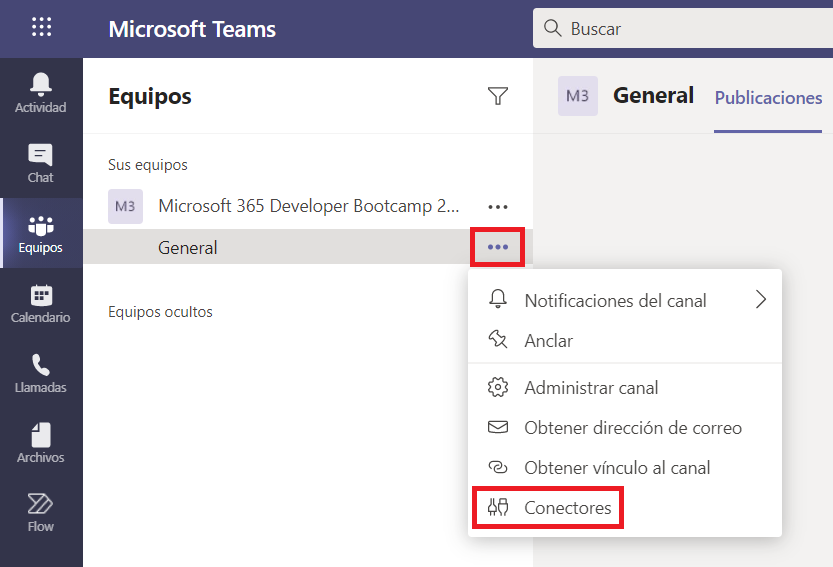

Aparecerá una nueva ventana con una cantidad enorme de conectores de entre los diferentes servicios. En este caso nosotros buscaremos y agregaremos el conector `Webhook entrante`.

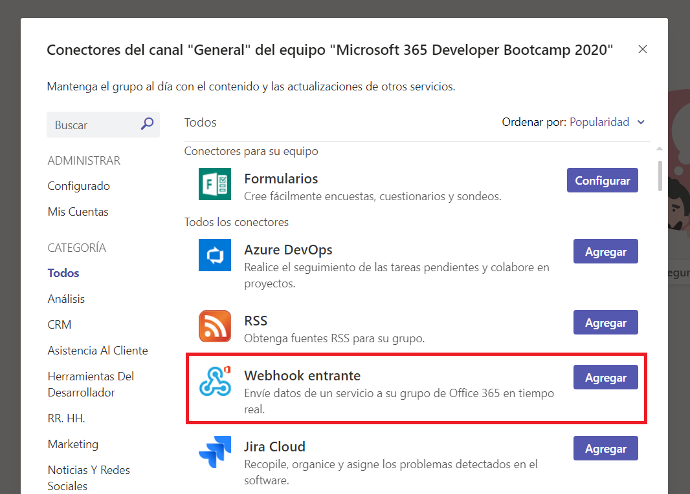

En la nueva pantalla nos indica que este conector nos sirve para "Enviar información de un servicio a un grupo de Office 365 en tiempo real". Lo agregamos.

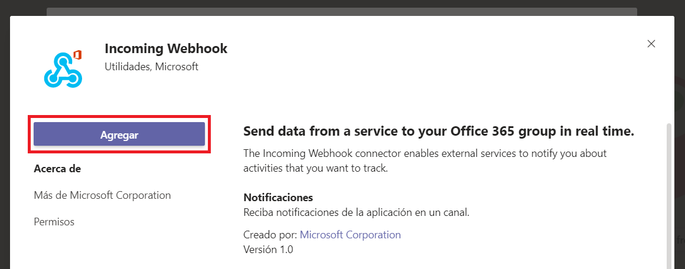

Una vez lo hayamos agregado nos aparecerá una nueva pantalla donde tendremos que indicar su nombre y personalizar la imagen si queremos. Esta imagen será la que aparecerá como el bot que escriba en el canal. Una vez hecho le daremos al botón `Crear`.

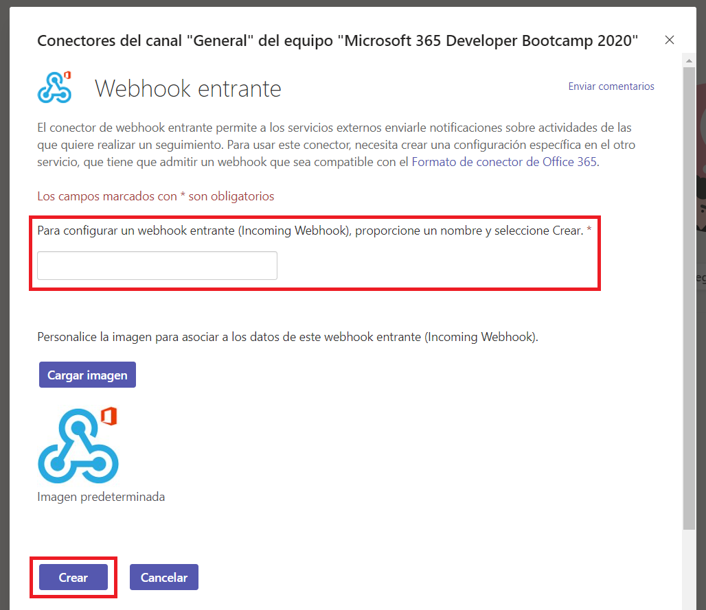

Cuando le hayamos dado a crear, en la parte inferior de esa ventana nos aparecerá una URL generada automáticamente. Esa es la URL que utilizaremos para nuestro conector personalizado. La copiamos y le damos a `Listo`. Nos aparecerá un mensaje en el equipo diciendo que hemos configurado el conector.

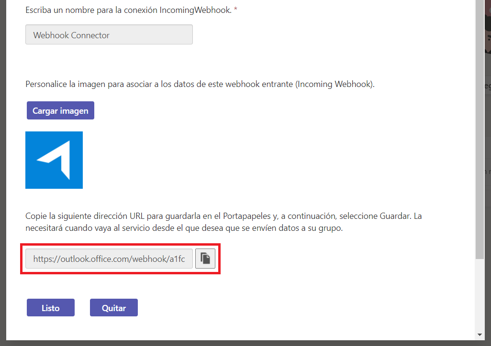

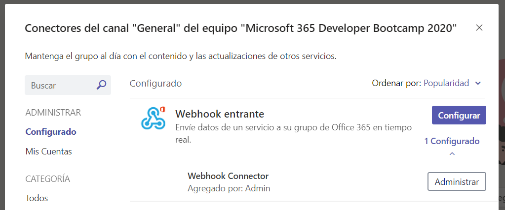

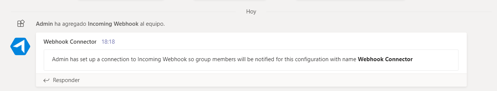

Ahora nos iremos a Postman para ver si podemos hacer la petición antes de continuar...

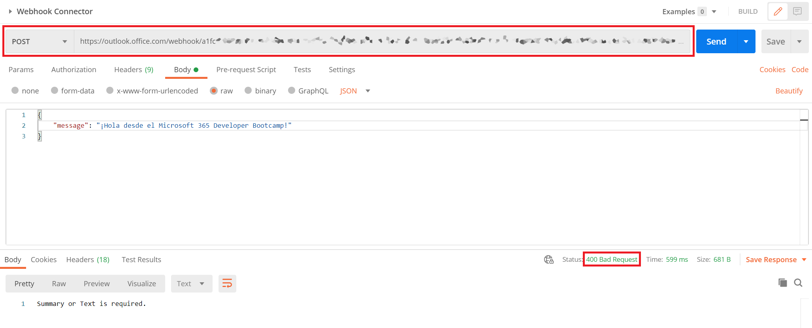

Uhm... parece que no le gusta los mensajes que le pasamos, y es porque el error `400 Bad Request` nos indica que se le debe pasar un payload en un [formato específico](https://docs.microsoft.com/en-us/outlook/actionable-messages/message-card-reference). Es hora de hablar de las **Actionable Message Cards**.

## Actionable Message Cards

Las tarjetas están diseñadas para ofrecer una información que se pueda leer de manera fácil y rápida y que, al fin y al cabo, los usuarios pueden descifrar y tratar de inmediato cuando corresponda. Existen muchos tipos de tarjetas para Microsoft 365, pero para poder trabajar con los webhooks entrantes el formato del payload **DEBE** ser una Actionable Message Card.


Podemos encontrar ejemplos de cómo se conforman en el [siguiente enlace](https://docs.microsoft.com/en-us/outlook/actionable-messages/message-card-reference#card-examples).

Para este ejemplo usaremos este pequeño código que implementaremos en nuestro Power Automate. Es hora de unir las piezas.

```json
{
  "type": "MessageCard",
  "context": "http://schema.org/extensions",
  "summary": "Notificación del Microsoft 365 Developer Bootcamp 2020",
  "sections": [
    {
      "activityImage": "https://www.pngkey.com/png/detail/444-4444265_topic-push-notification-icon-icone-notification.png",
      "activityTitle": "@{triggerBody()['titulo']}",
      "activitySubtitle": "@{triggerBody()['subtitulo']}",
      "activityText": "@{triggerBody()['mensaje']}"
    }
  ]
}
```

## Flujo en Power Automate

Para poder unir las dos piezas vamos a tener que constuir nuestro pequeño flujo que mande la información del payload anterior a nuestro endpoint generado por el webhook. En este ejemplo vamos a lanzar el flujo manualmente, pero al endpoint deberéis llamarlo desde vuestra aplicación de origen 😉

### Desencadenar flujo manualmente

Desencadenaremos el flujo manualmente con tres parámetros de entrada: `titulo`, `subtitulo`, `mensaje`, que se corresponden a los que hemos definido en el payload del JSON:

```json
    "activityTitle": "@{triggerBody()['titulo']}",
    "activitySubtitle": "@{triggerBody()['subtitulo']}",
    "activityText": "@{triggerBody()['mensaje']}"
```


### Acción 'HTTP'

Crearemos posteriormente una acción HTTP. Ojo, que este conector es Premium, por lo que requerirá licencia para su uso. Para este workshop podéis habilitar la versión de prueba de 30 días.

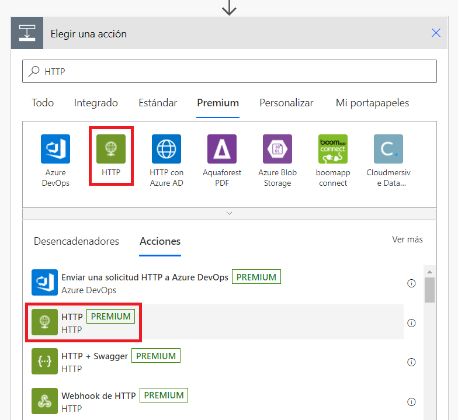

En él tendremos que rellenar:

* **Método:** POST
* **URI:** El endpoint que nos dio el webhook entrante de Teams a la hora de crearlo.
* **Cuerpo:** El JSON correspondiente a nuestra Message Card.

El resto de campos los podemos dejar tal cual. Guardamos el flujo.

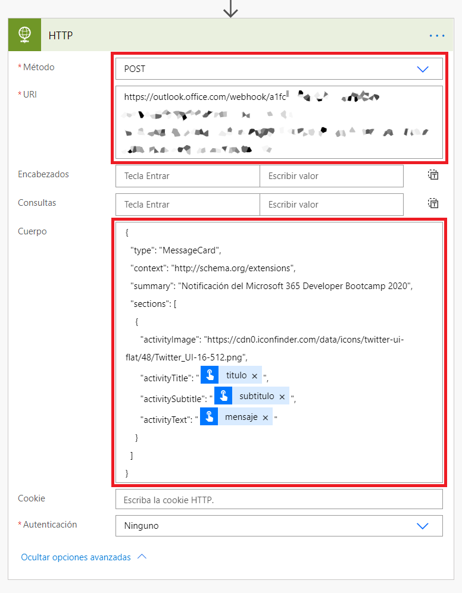

## ¡Hora de probar!

Ya tenemos nuestro webhook configurado y nuestro flujo que mandará el payload a dicho webhook. Ahora nos toca probarlo. Para ello simplemente desencadenaremos la acción desde Power Automate con nuestros propios datos.

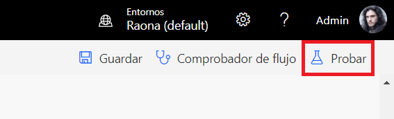

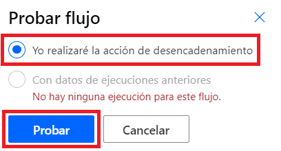

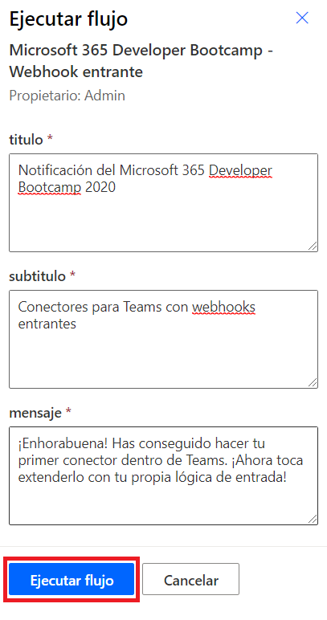

Y una vez ejecutado, veremos nuestro resultado en Teams:

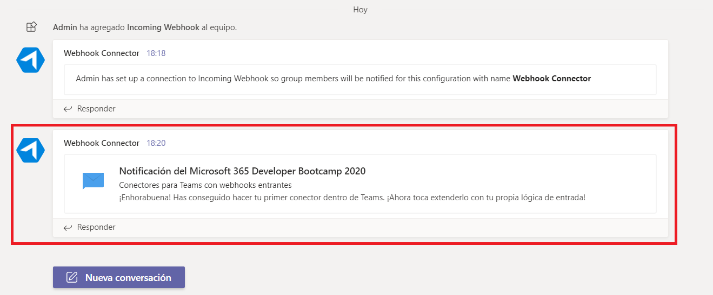

## ¿Quieres más?

Vamos al siguiente workshop, donde [crearemos un conector personalizado en una WebApp de Azure.](../webapp-connector/readme.md). De esta forma podremos tener el control completo de nuestro back-end y poder extenderlo de forma empresarial a todos los canales a través de una app.