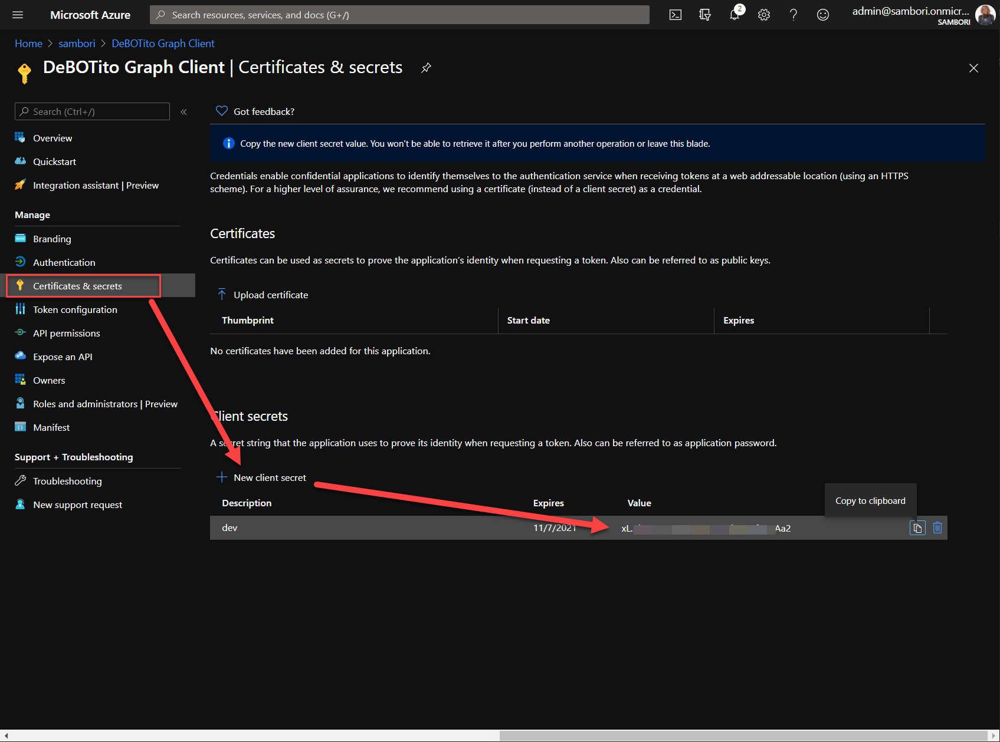

# Desarrollando MS Teams Messaging Extensions usando SPFx (M365 Dev Bootcamp 2020 Virtual)

En este laboratorio, vamos a ver como podemos desarrollar Messaging Extensions para MS Teams, utilizando SPFx para la mayor parte de la funcionalidad.

## (WIP) Indice

  - Introducción
  - Pre-requisitos: Azure subscription, Office 365 Tenant, SPFx, Yo Teams, ngrok...
  - Registrar Bot Channel: registrar, añadir Teams channel...
  - Crear Secret para la AAD App creada por el Bot Channel
  - Registrar Azure AD App para llamar a Graph desde el Bot
  - SPFx Webpart
  - Deploy SPFx webpart
  - Deploy Teams manifest
  - Crear Bot (actualizar ngrok URL en Bot Registration)
  - Funciona!

## Introducción

Antes de empezar con el laboratorio, si no se sabe lo que son Messaging Extensions, se recomienda la lectura del siguiente artículo: [https://docs.microsoft.com/en-us/microsoftteams/platform/messaging-extensions/what-are-messaging-extensions](https://docs.microsoft.com/en-us/microsoftteams/platform/messaging-extensions/what-are-messaging-extensions).

Básicamente, las messaging extensions nos van a permitir que el usuario de Teams, interactúe con acciones personalizadas, desde la misma applicación o web de Teams.

En este laboratorio vamos a desarrollar un _Action Command_ que va a permitir al usuario listar todos los Teams de la tenant (limitaremos a 20), seleccionar un Teams, y que la información principal de ese Team: título, descrición, imagen y link, se envíen por chat, como parte de la conversación. 

### Caso de uso del lab

El escenario que se pretende cubrir es el siguiente: Imaginemos que en una conversación de un Team, o en un chat con algún compañero, te preguntan donde pueden encontrar cierta información. Tú sabes qué Team es el adecuado, donde tu compañero puede buscar en sus documentos o conversaciones, así que usando la messaging extension, seleccionas el Team adecuado, y envías la info del Team al tu compañero, que desde el mismo chat, puede saltar a ese Team. La siguiente imagen representa el caso de uso descrito, y el resultado final de este lab.


## Pre Requisitos

Para completar el laboratorio, se requiere (recomendamos acudir al lab con esto ya instalado/configurado, de lo contrario, seguramente no dará tiempo a completar el lab):

- Suscripción de Azure con usuario Administrador de la misma
- Tenant de Office 365 con usuario Administrador de la misma
- Prepara tu Tenant para Teams development. Sigue estos pasos: [https://docs.microsoft.com/en-us/microsoftteams/platform/concepts/build-and-test/prepare-your-o365-tenant](https://docs.microsoft.com/en-us/microsoftteams/platform/concepts/build-and-test/prepare-your-o365-tenant)
- SPFx dev enviroment actualizado a la última versión (follow steps here: [https://docs.microsoft.com/en-us/sharepoint/dev/spfx/set-up-your-development-environment](https://docs.microsoft.com/en-us/sharepoint/dev/spfx/set-up-your-development-environment))
- [ngrok](https://ngrok.com/) instalado y configurado. Sigue estos pasos:
    - Crea una cuenta en la web de ngrok (es gratis)
    - Instala ngrok usando npm: 
        ```js 
        npm install ngrok -g   
        ```
    - Configura el Auth Token de ngrok (al crearte la cuenta, la web te dará esa información)
        ```js
        ngrok authtoken <YOUR_AUTHTOKEN>
        ```
- Visual Studio Code ... alguien no lo tiene?! :D
- Instala el generador para Teams de Yeoman:
    ```js
    npm install yo gulp-cli --global
    npm install generator-teams --global
    ```

## Registro del Bot Channel en Azure

A pesar de que la mayor parte de la funcionalidad de nuestra messaging extension se va a resolver en el lado de spfx (desarrollaremos un webpart de spfx tal cual, que funcionará dentro de Teams), a la hora de enviar información al control de "componer mensaje" de Teams, es necesario un bot que habilite el canal con MS Teams. Para ello, registraremos un Bot Channel en Azure.

Abrimos el portal de Azure, y seguimos los pasos descritos en la siguiente imagen:


Una vez creado, ve al recurso, y en la sección de __Channels__, habilita el canal para __Teams__


Ahora vamos a la sección de __Settings__ donde guardaremos el Identificador de la Azure Active Directory App que se ha registrado para nuestro bot, y clicaremos en el link de __Manage__, ya que necesitamos configurar algunas cosas de la AAD App.


Crea un nuevo Secret para la App, y guárdalo a buen recaudo junto al App ID


Vuelve a la pantalla de __Settings__ del Channel, porque luego necesitaremos actualizar el _messaging endpoint_, así que deja el navegador abierto en esa pantalla.

## Registrar Azure AD App para llamar a Graph desde el Bot

Es tiempo ahora de registar una nueva aplicación de Azure Active Directory, que nos va a servir para poder consumir datos de MS Graph API desde nuestro bot.
__Importante__: Esta nueva App, hay que registrarla en el Azure Active Directory de la Tenant de Office 365. El registro del Bot puede hacerse en cualquier suscripción de Azure, que puede estar en el mismo Directorio que la Tenant de Office 365, o no, de ahí que esta App se requira registar en el Directorio de la Tenant de Office 365, que es donde finalmente están los datos que queremos consumir a través de la Graph API.

Abrimos el portal de Azure de la Tenant de Office 365, vamos a la sección de __App Registrations__ y registramos una nueva Aplicación, tal y como muestra la imagen siguiente:


Una vez creada la App, guarda a buen recaudo el Client ID y Tenant ID:


Ahora necesitamos crear un nuevo __Secret__, que de nuevo guardaremos a buen recaudo para utilizar luego en nuestro código:



Finalmente, ya que el objetivo de esta AAD App es poder consumir información de Graph, en nuestro caso queremos listar los Teams de la Tenant, debemos asignar los permisos necesarios en Graph. Para ello saltamos a la sección __API Permissions__


Seleccionamos ahora permisos de Aplicación, y añadimos permisos para poder leer los Grupos de la Tenant.


Una vez añadido el permiso, y al ser éste de Aplicación, debemos dar consentimiento a nivel de Administrador, así que clicamos en el botón de __Grant Admin permissions__ y confirmamos el mensaje.


Llegado a este punto, es por fin momento de empezar con el código... acaso no es esto un Developer Bootcamp?!!

## List Teams SPFx Webpart

Vamos a crear nuestro Webpart de SPFx que luego registraremos como Teams messaging extension. Este webpart es donde se hará la mayor parte de la funcionalidad. En él, utilizando el Graph Http Client del propio framework, accederemos a la Graph API y sacaremos los 20 primeros Teams de la Tenant.

Antes de crear el Webpart, crea una carpeta que contendrá la solución completa, que incluye el webpart, y también el Bot.

```js
mkdir mge-spfx-lab
```

Y ahora crea otra carpeta para el proyecto del SPFx Webpart

```js
mkdir spfx-teams-webpart
```

Dentro de esta útlima carpeta, lanza el comando de Yeoman para crear el proyecto SPFx:

```js
yo @microsoft/sharepoint
```

Puedes dejar los valores por defecto que te va ofreciendo el asistente de Yeoman en casi todas las preguntas. Tan solo cambia el nombre del webpart, y asegúrate de elegir __React__ como framework. La siguiente imagen tiene todos los valores a asignar:


Después de 1 minuto (o 2), ya tendrás tu webpart creado, así que es momento de añadir la funcionalidad que queremos.

Primero de todo, añade unas nueva carpetas dentro de la carpeta __src__:
  - models

Dentro de esa carpeta, crea un ficher __IGraphTeam.ts__. Esta interfaz va a modelar la información que necesitaremos de un Team: nombre, descripción, imagen, y poco más.

Así que añade el siguiente código a dicho fichero:

```ts
export interface IGraphTeam {
  id: string;
  displayName: string;
  description: string;
  thumbnailUrl: string;
}
```

Haciendo uso de la "componentización", nuestro webpart de SPFx estará compuesto por los siguientes componente de React:


  - __TeamsListWebPart__: es el webpart propiamente dicho. Su trabajo es inicializar ciertas cosas relacionadas con el mismo framework de SPFx, como por ejemplo la librería del PnPJS, o determinar si estamos corriendo en el contexto de una Teams messaging extension (recuerda que al ser un webpart, éste podría correr perfectamente en una página de SharePoint, o una Tab de Teams, y en ese caso, la funcionalidad estaría limitada). Además, inicializa el componente hijo, pasando las _props_ necesarias (por ejemplo el contexto de Teams).
  - __TeamsList__: Este sería lo que React un llama _Smart Component_. Se encarga de sacar los datos llamando a la API de Graph, y pasar estos datos a su componente hijo. También se encarga de renderizar un mensaje de carga de datos, mientras los datos no han sido obtenidos (el típico _spinner_ de "_Loading data_")
  - __AllTeams__: este componente ya renderiza los datos como una lista de componentes TeamDetail
  - __TeamDetail__: este componente renderiza la información de un Team concreto, además de realizar la acción de "_Share Team_", que llamará al Bot para que la información del Team se incruste en el chat de MS Teams.

Siendo así, vamos a crear los siguientes nuevos ficheros dentro de la carpeta __components__:

__ITeamsListState.ts__

Define el estado del componente ITeamsListState, que basicamente será una lista de Teams. Añadimos el siguiente código al archivo:

```ts
import { IGraphTeam } from "../../../models/IGraphTeam";

export interface ITeamsListState {
  teams: IGraphTeam[];
}
```

Para dar el _look and feel_ deseado, vamos a editar el ficher existente __TeamsList.module.scss__ con el siguiente código:

```css
@import '~office-ui-fabric-react/dist/sass/References.scss';

.teamsList {
  .image {
    display: block;
    border: 0;
    width: 100%;
    height: auto;
  }

  .cards {
    display: flex;
    flex-wrap: wrap;
    justify-content: space-between;
 }

  .card {
    /* Add shadows to create the "card" effect */
    box-shadow: 0 4px 8px 0 rgba(0,0,0,0.2);
    transition: 0.3s;
    flex: 0 1 calc(35% - 1em);
  }

  /* On mouse-over, add a deeper shadow */
  .card:hover {
    box-shadow: 0 8px 16px 0 rgba(0,0,0,0.2);
  }

  /* Add some padding inside the card container */
  .container {
    padding: 2px 16px;
  }
}
```

Seguimos con el componente de más abajo de la jerarquía. Añade el fichero __TeamDetail.tsx__ con el siguiente código:

```ts
import * as React from 'react';

import styles from './TeamsList.module.scss';
import { IGraphTeam } from '../../../models/IGraphTeam';
import { IIconProps } from 'office-ui-fabric-react/lib/components/Icon/Icon.types';
import { ActionButton } from 'office-ui-fabric-react/lib/components/Button/ActionButton/ActionButton';
import { IMicrosoftTeams } from '@microsoft/sp-webpart-base';

export interface IGroupDetailProps {
  group: IGraphTeam;
  isTeamsMessagingExtension?: boolean;
  teamsContext?: IMicrosoftTeams;
}

export interface IGroupDetailState {}

export default class GroupDetail extends React.Component<IGroupDetailProps, IGroupDetailState> {

  private groupClicked = (group: IGraphTeam): void => {
    console.log("About to share group info", group);
    if (this.props.isTeamsMessagingExtension) {
      this.props.teamsContext.teamsJs.tasks.submitTask(group);
    }
  }

  public render(): React.ReactElement<IGroupDetailProps> {

    const shareIcon: IIconProps = { iconName: 'Share' };

    return (
      <div className={styles.card}>
        </img>
        <div className={styles.container}>
          <h4><b>{this.props.group.displayName}</b></h4>
          <p>{this.props.group.description}</p>
          <div>
          <ActionButton
            iconProps={shareIcon}
            key={this.props.group.id}
            onClick={() => this.groupClicked(this.props.group)}>Share Team</ActionButton>
          </div>
        </div>
      </div>
    );
  }
}
```

Échemos un vistazo a las partes más importantes.

El método __render__ no tiene mucho misterio, tan solo algunos DIVs para pintar la info del Teams (título, imagen, etc). Hacemos uso de algunos componentes del FluentUI, como el __ActionButton__, y cuando el botón se clica, lo que hacemos es enviar la información del Team, al Bot que está a la escucha. Esto lo hacemos a través del mismo framework de spfx, con el método __submitTask__:

```ts
    if (this.props.isTeamsMessagingExtension) {
      this.props.teamsContext.teamsJs.tasks.submitTask(group);
    }
```

Vamos ahora a crear un nuevo fichero llamado __AllTeams.tsx__ con el siguiente código:

```ts
import * as React from 'react';
import styles from './TeamsList.module.scss';

import { IGraphTeam } from "../../../models/IGraphTeam";
import TeamDetail from './TeamDetail';
import { IMicrosoftTeams } from '@microsoft/sp-webpart-base';

export interface IAllTeamsProps {
  teams: IGraphTeam[];
  isTeamsMessagingExtension?: boolean;
  teamsContext?: IMicrosoftTeams;
}

export interface IAllTeamsState {}

export default class AllTeams extends React.Component<IAllTeamsProps, IAllTeamsState> {
  public render(): React.ReactElement<IAllTeamsProps> {

    const teams = this.props.teams.map(team => {
      return <TeamDetail
        group={team}
        isTeamsMessagingExtension={this.props.isTeamsMessagingExtension}
        teamsContext={this.props.teamsContext} />;
    });

    return (
      <div className={styles.teamsList}>
        <div className={styles.cards}>
          {teams}
        </div>
      </div>
    );
  }
}
```