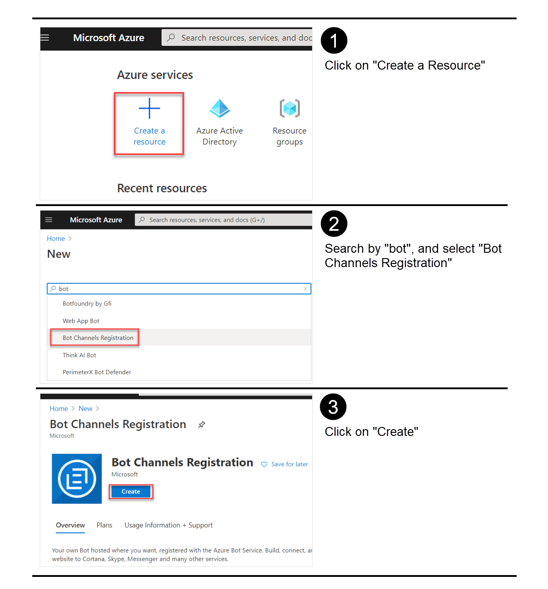

# Desarrollando MS Teams Messaging Extensions usando SPFx (M365 Dev Bootcamp 2020 Virtual)

En este laboratorio, vamos a ver como podemos desarrollar Messaging Extensions para MS Teams, utilizando SPFx para la mayor parte de la funcionalidad.

## (WIP) Indice

  - Introducción
  - Pre-requisitos: Azure subscription, Office 365 Tenant, SPFx, Yo Teams, ngrok...
  - Registrar Bot Channel: registrar, añadir Teams channel...
  - Crear Secret para la AAD App creada por el Bot Channel
  - Registrar Azure AD App para llamar a Graph desde el Bot
  - SPFx Webpart
  - Deploy SPFx webpart
  - Deploy Teams manifest
  - Crear Bot (actualizar ngrok URL en Bot Registration)
  - Funciona!

## Introducción

Antes de empezar con el laboratorio, si no se sabe lo que son Messaging Extensions, se recomienda la lectura del siguiente artículo: [https://docs.microsoft.com/en-us/microsoftteams/platform/messaging-extensions/what-are-messaging-extensions](https://docs.microsoft.com/en-us/microsoftteams/platform/messaging-extensions/what-are-messaging-extensions).

Básicamente, las messaging extensions nos van a permitir que el usuario de Teams, interactúe con acciones personalizadas, desde la misma applicación o web de Teams.

En este laboratorio vamos a desarrollar un _Action Command_ que va a permitir al usuario listar todos los Teams de la tenant (limitaremos a 20), seleccionar un Teams, y que la información principal de ese Team: título, descrición, imagen y link, se envíen por chat, como parte de la conversación. 

### Caso de uso del lab

El escenario que se pretende cubrir es el siguiente: Imaginemos que en una conversación de un Team, o en un chat con algún compañero, te preguntan donde pueden encontrar cierta información. Tú sabes qué Team es el adecuado, donde tu compañero puede buscar en sus documentos o conversaciones, así que usando la messaging extension, seleccionas el Team adecuado, y envías la info del Team al tu compañero, que desde el mismo chat, puede saltar a ese Team. La siguiente imagen representa el caso de uso descrito, y el resultado final de este lab.


## Pre Requisitos

Para completar el laboratorio, se requiere (recomendamos acudir al lab con esto ya instalado/configurado, de lo contrario, seguramente no dará tiempo a completar el lab):

- Suscripción de Azure con usuario Administrador de la misma
- Tenant de Office 365 con usuario Administrador de la misma
- Prepara tu Tenant para Teams development. Sigue estos pasos: [https://docs.microsoft.com/en-us/microsoftteams/platform/concepts/build-and-test/prepare-your-o365-tenant](https://docs.microsoft.com/en-us/microsoftteams/platform/concepts/build-and-test/prepare-your-o365-tenant)
- SPFx dev enviroment actualizado a la última versión (follow steps here: [https://docs.microsoft.com/en-us/sharepoint/dev/spfx/set-up-your-development-environment](https://docs.microsoft.com/en-us/sharepoint/dev/spfx/set-up-your-development-environment))
- [ngrok](https://ngrok.com/) instalado y configurado. Sigue estos pasos:
    - Crea una cuenta en la web de ngrok (es gratis)
    - Instala ngrok usando npm: 
        ```js 
        npm install ngrok -g   
        ```
    - Configura el Auth Token de ngrok (al crearte la cuenta, la web te dará esa información)
        ```js
        ngrok authtoken <YOUR_AUTHTOKEN>
        ```
- Visual Studio Code ... alguien no lo tiene?! :D
- Instala el generador para Teams de Yeoman:
    ```js
    npm install yo gulp-cli --global
    npm install generator-teams --global
    ```

## Registro del Bot Channel en Azure

A pesar de que la mayor parte de la funcionalidad de nuestra messaging extension se va a resolver en el lado de spfx (desarrollaremos un webpart de spfx tal cual, que funcionará dentro de Teams), a la hora de enviar información al control de "componer mensaje" de Teams, es necesario un bot que habilite el canal con MS Teams. Para ello, registraremos un Bot Channel en Azure.

Abrimos el portal de Azure, y seguimos los pasos descritos en la siguiente imagen:




Una vez creado, ve al recurso, y en la sección de __Channels__, habilita el canal para __Teams__


Ahora vamos a la sección de __Settings__ donde guardaremos el Identificador de la Azure Active Directory App que se ha registrado para nuestro bot, y clicaremos en el link de __Manage__, ya que necesitamos configurar algunas cosas de la AAD App.


Crea un nuevo Secret para la App, y guárdalo a buen recaudo junto al App ID


Vuelve a la pantalla de __Settings__ del Channel, porque luego necesitaremos actualizar el _messaging endpoint_, así que deja el navegador abierto en esa pantalla.
