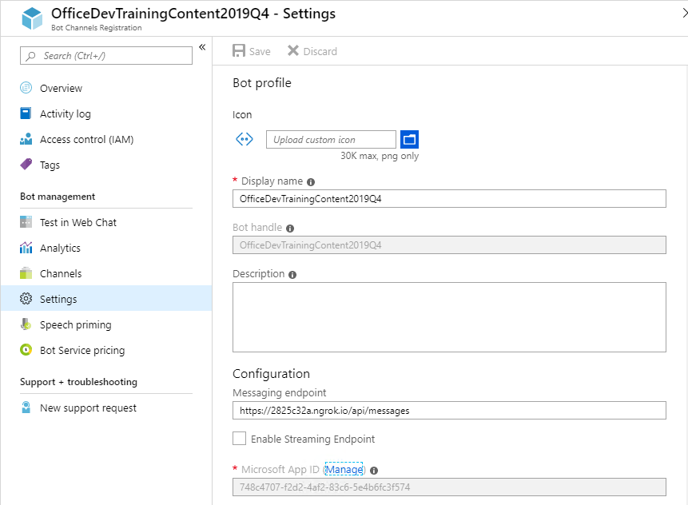

## Registrar el bot

1. Abre el [Azure Portal](https://portal.azure.com).

1. Seleccione Crear un recurso.

1. En el cuadro Buscar en el mercado, introduzca bot.

1. Elija Registro de Canales de Bot

1. Seleccione el pulsador Crear.

1. Completa la hoja de Registro de Canales de Bot. Para el nombre del Bot, introduzca un nombre descriptivo.

1. Introduzca la siguiente dirección para el punto final de Mensajería. Sustituya el token[dengrok] por la dirección de reenvío que se muestra en la ventana ngrok.
    ```
    https://[from-ngrok].ngrok.io/api/Messages
    ```
1. Permite que el servicio cree automáticamente una aplicación.

1. Seleccione Crear.

1. Cuando finalice la implementación, navegue hasta el recurso en el portal de Azure. En la parte izquierda de la navegación, seleccione Todos los recursos. En la pestaña Todos los recursos, seleccione el Registro de Canales Bot.

1. En la sección Administración de bots, seleccione Canales.
    

1. Haga clic en el logotipo de Microsoft Teams para crear una conexión con Teams. Seleccione Guardar. Acepta los Términos de Servicio.
    

1. En la pestaña de Registro de Canales Bot, seleccione Configuración en Administración de Bots.
     

1. Se muestra el Id. de la aplicación de Microsoft. Copia este valor.

1. Junto al Id. de aplicación de Microsoft, seleccione el enlace Administrar. Esto le llevará a la hoja de registro de la aplicación.

1. En la hoja de aplicación, seleccione Certificados y secretos.

1. Seleccione Nuevo secreto de cliente.

1. Introduzca una descripción y seleccione un intervalo de caducidad. Seleccione Añadir.

1. Se crea y muestra un nuevo secreto. Graba el nuevo secreto.
    

1. Una vez que tengamos el clientId y clientSecret lo añadimos en nuestro proyecto de Visual Studio dentro del fichero appsettings.json
```
{
  "MicrosoftAppId": "[clientId]",
  "MicrosoftAppPassword": "[clientSecret]"
}
```