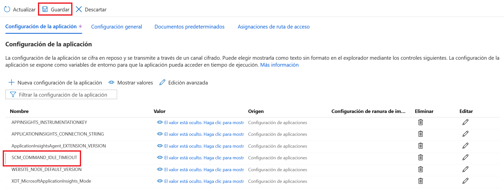

# Creación de un conector personalizado en una WebApp de Azure

## Introducción

Una vez hayamos utilizado los [webhooks entrantes de Teams](../incoming-webhooks/readme.md), podemos darnos cuenta de que puede servirnos para alguna función específica, pero no podemos extenderlo a cualquier quipo y canal de la compañía. Para eso tendremos que dotar a nuestro conector de un back-end que crearemos y personalizaremos para luego desplegarlo en Azure.

## Creación de la WebApp en Azure

_Si ya sabes crear una WebApp puedes saltarte este punto e ir directamente a la configuración_

1. Para crea una WebApp en Azure tendremos que ir al [Portal Azure](https://portal.azure.com).
2. Una vez dentro, iremos al apartado de App Services y pulsaremos en `Agregar` en la barra superior.
3. En la nueva ventana rellenaremos la siguiente información:

    * **Suscripción:** Elegiremos aquella que tengamos configurada en el portal.
    * **Grupo de recursos:** Elegiremos el grupo de recursos que deseemos. En este caso nosotros crearemos uno nuevo para **Teams**.
    * **Nombre de la instancia:** m365bootcamp-connector
    * **Publicar:** Código
    * **Pila del entorno en tiempo de ejecución:** Node 10.14
    * **Sistema operativo:** Windows
    * **Región:** Oeste de Europa (West Europe)
    * **Plan de Windows:** Crearemos uno nuevo. Lo llamaremos **Teams**
    * **SKU y tamaño:** Estándar S1

4. Pulsamos en `Siguiente: Supervisión`
5. En este caso nos preguntará si queremos habilitar Application Insights para esta WebApp. Por simplicidad de este workshop vamos a seleccionar que **NO**, aunque si queremos hacerlo podemos dejar el que crea por defecto y luego tendremos que sacar su Instrumentation Key.
6. Pulsamos en `Revisar y crear` y dejaremos unos minutos a que se aprovisionen todos los elementos.

### Configuración de la WebApp

Una vez tengamos la WebApp creada tendremos que configurarla para poder utilizarla en nuestro conector. Para ello iremos al apartado `Configuración` y añadiremos una `Nueva configuración de la aplicación` con los siguientes datos:

* **SCM_COMMAND_IDLE_TIMEOUT:** 1800

Aceptamos, guardamos los cambios en el menú superior y volvemos a aceptar.



## Creación del proyecto

Lo primero que tenemos que hacer es crearnos un proyecto con Yeoman. Para eso abriremos nuestra consola favorita y lanzaremos el comando `yo teams`:


Y crearemos el conector siguiendo las instrucciones del generador y con la siguiente información:

* **What is your solution name?** m365bootcamp-connector
* **Where do you want to place the files?** Create a sub folder with solution name
* **Title of your Microsoft Teams App project?** M365BootcampConnector
* **Your (company) name? (max 32 characters)** Microsoft 365 Bootcamp
* **Which manifest version would you like to use?** v1.8
* **Enter your Microsoft Partner ID, if you have one?** (Leave blank to skip)
* **What features do you want to add to your project?** A Connector
* **The URL where you will host this solution?** La URL de vuestra WebApp. En este workshop será `https://m365bootcamp-connector.azurewebsites.net`
* **Would you like show a loading indicator when your app/tab loads?** No
* **Would you like personal apps to be rendered without a tab header-bar?** No
* **Would you like to include Test framework and initial tests?** Yes
* **Would you like to use Azure Applications Insights for telemetry?** No
* **What type of Connector would you like to include?** A new Connector hosted in this solution
* **What is the ID of your Connector (found in the Connector Developer Portal)?** Aquí dejaremos el GUID por defecto (00000000-0000-0000-0000-000000000000), ya que aún no tenemos esta información. La modificaremos más adelante en el proyecto.
* **What is the name of your Connector?** M365BootcampConnector

> **NOTA:** En este workshop no configuraremos Azure Application Insights para el conector por simplicidad, pero podéis elegir que sí en el generador y alimentar la Instrumentation Key que hayáis extraído de Azure o hacerlo posteriormente una vez hayamos creado el conector en el fichero de configuración.

Una vez hayamos rellenado toda esta infomación, se empezará a realizar el _scaffolding_ de la solución y a bajarse todos los paquetes necesarios. Podemos ir a prepararnos un café ☕

## Estructura del proyecto

Una vez tengamos creado el proyecto, lo abriremos con `code .` y veremos la siguiente estructura:


En ella tendremos en cuenta los siguientes archivos. Iremos de abajo a arriba:

### `.env`

Es nuestro fichero de configuración. De él se extraerá la información clave para generar el fichero `manifest.json` de la carpeta `package` para poder subirlo luego a Teams. En él podemos encontrar las siguientes claves:

* **HOSTNAME:** La URL de Azure que hemos indicado en el generador.
* **APPLICATION_ID:** ID interno de la aplicación de Teams.
* **PACKAGE_NAME:** Nombre del paquete que se generará al compilar.
* **CONNECTOR_ID:** GUID del conector que generaremos en el próximo paso.
* **APPINSIGHTS_INSTRUMENTATIONKEY:** Intrumentation Key del Application Insights de nuestra WebApp para generar log del conector.

El resto de claves pueden ser ignoradas.

### `manifest.json`

Será el fichero que contendrá toda la información de la aplicación que subamos a Teams. Aquí podremos modificar la siguiente información para mostrarla cuando instalemos la aplicación:

```json
  "name": {
    "short": "M365BootcampConnector",
    "full": "M365BootcampConnector"
  },
  "description": {
    "short": "TODO: add short description here",
    "full": "TODO: add full description here"
  },
  "icons": {
    "outline": "icon-outline.png",
    "color": "icon-color.png"
  },
  "accentColor": "#D85028",
```

Los campos que están entre llaves dobles `{{HOSTNAME}}` se modificarán en tiempo de compilación por los valores del archivo `.env`.

```json
  "id": "{{APPLICATION_ID}}",
  "version": "{{VERSION}}",
  "packageName": "{{PACKAGE_NAME}}",
  "developer": {
    "name": "Microsoft 365 Bootcamp",
    "websiteUrl": "https://{{HOSTNAME}}",
    "privacyUrl": "https://{{HOSTNAME}}/privacy.html",
    "termsOfUseUrl": "https://{{HOSTNAME}}/tou.html"
  },
```

### `server.ts`

Contiene la lógica para crear nuestros endpoints.

### `M365BootcampConnectorConfig.tsx`

Componente React que contiene la lógica necesaria a la hora de registrar la aplicación en Teams. Además, renderiza las pantallas que podamos necesitar a la hora de configurar la instalación del conector.

> **NOTA:** Anotaos de este fichero la URL sin parámetros del objeto `settings.contentUrl`, ya que la necesitaremos luego para registrar el conector. Recordad que la variable `${process.env.HOSTNAME}` tendremos que modificarla por el valor de `HOSTNAME` en nuestro fichero `.env`. En este workshop sería:

```code
https://m365bootcamp-connector.azurewebsites.net/m365BootcampConnector/config.html
```

### `M365BootcampConnector.ts`

Implementación del conector que administrar el registro de nuevas suscripciones (`Connect()`) y un método de ejemplo para enviar un mensaje al canal (`Ping()`).

### Modificaciones del proyecto

Bueno, si se quiere subir a Azure, hay que hacer primero algunos cambios, porque si no, no funcionará nada de lo que tengamos el proyecto. Para ello modificaremos:

#### `M365BootcampConnectorConfig.tsx`

En este archivo tendremos que cambiar la línea 58 para que en vez de apuntar a variable de entorno `${process.env.HOSTNAME}` (que debería contener nuestra URL de Azure) apunte a la variable de entorno de **Azure** `${process.env.WEBSITE_HOSTNAME}` que ya existe y tiene la misma información.

#### `M365BootcampConnector.ts`

Mismo cambio que antes, pero esta vez en la línea 77. 

## Registro del conector en el Connectors Developer Dashboard

Para poder hacer uso de nuestro conector, tendremos que darlo de alta en el [Connectors Developer Dashboard](https://outlook.office.com/connectors/publish). Este dashboard es donde deberemos dar de alta los conectores si queremos publicarlos en la App Store de Teams y poder ofrecerlo dentro de la plataforma para todo el mundo.

> **NOTA:** Tienes que registrar el conector en el mismo tenant donde vas a probar el conector. Si no, será necesario publicar el conector en la tienda (con toda la burocracia y revisiones que lleva...).

Cuando entremos le daremos a `New Connector` y nos saldrá un formulario que rellenaremos con la siguiente información:

* **Connector name:** M365 Bootcamp Connector
* **Logo:** _La imagen que vosotros queráis_
* **Short description of your app (10 words or less):** _La descripción corta que vosotros queráis_
* **Detailed description of what your Connector does (3-5 sentences):** _La descripción detallada que vosotros queráis_
* **Company website:** _El nombre de vuestra compañía_
* **Configuration page for your Connector:** Aquí pondréis la URL que extrajimos del archivo `M365BootcampConnectorConfig.tsx`. En este workshop será `https://m365bootcamp-connector.azurewebsites.net/m365BootcampConnector/config.html`
* **Valid domains:** La URL de vuestra WebApp. En este workshop será `https://m365bootcamp-connector.azurewebsites.net/`
* **Do you want to enable actions on your Connector cards?:** Yes
* **Actions URL:** La URL de vuestra WebApp + `api/connector`. En este workshop será `https://m365bootcamp-connector.azurewebsites.net/api/connector`

Aceptamos la licencia y guardamos.

Una vez esté el conector guardado, **copiaremos el GUID que aparece en la URL**, ya que lo utilizaremos para añadirlo en el archivo de configuración `.env` que se nos generará cuando creemos el proyecto en el siguiente punto.


Una vez tengamos esto, pasaremos a desplegar nuestro conector en Azure.

## Despliegue del conector en Azure

El despliegue de la aplicación se hará a través de DevOps contra la WebApp de Azure. Para ello tendremos que configurarlo previamente en nuestra WebApp.

1. Nos iremos al [Portal Azure](https://portal.azure.com) y accederemos a nuestra WebApp.
2. Una vez dentro iremos al apartado del `Centro de implementación`
3. En la nueva ventana elegiremos `Local Git` y le daremos al botón de `Continuar`.


4. En la siguiente ventana elegiremos `Servicio de compilación de App Service` y pulsaremos nuevamente en `Continuar`


5. Por último pulsaremos en `Finalizar` para que se configure la implementación.
6. Una vez realizado, necesitaremos guardarnos la siguiente información para la implementación: `URI de Git Clone` en la pantalla principal y `Nombre de usuario`y `Contraseña` dentro del botón `Credenciales de implementación` del menú superior.


Ahora estamos listos para desplegar:

1. Inicializaremos el repositorio Git con el comando `git init`
2. Compilaremos la solución usando `gulp build` para asegurarnos que no hay errores.
3. Haremos commit de todos nuestros archivos con `git add -A` y posteriormente `git commit -m "Initial commit"`
4. Ejecutaremos el siguiente comando para configurar el repositorio remoto: `git remote add  azure 'https://<username>@<URIGitClone>'`. En nuestro ejemplo será: `git remote add azure 'https://$m365bootcamp-connector@m365bootcamp-connector.scm.azurewebsites.net:443/m365bootcamp-connector.git'`
5. Para subir los cambios de nuestro código a Azure usaremos el siguiente comando: `git push azure master`. Si es la primera vez nos preguntará por las credenciales. Mucho cuidado porque en la ventana que nos aparezca el usuario vendrá mal informado..
6. Esperaremos a que el despliegue se complete (vete a por otro café, porque el primer despliegue tiene que subir hasta los node_modules... ☕) y navegaremos a la siguiente URL para comprobar que la aplicación web está corriendo correctamente: `<URLWebApp>/privacy.html`, que en nuestro caso será `https://m365bootcamp-connector.azurewebsites.net/privacy.html`. Deberemos ver esto:


5. **BOOM! It's done!** Ya tenemos nuestra aplicación desplegada en Azure.
6. Por último generaremos el paquete de la aplicación de Teams con `gulp manifest`. Éste aparecerá en el nuevo directorio `package`.
7. Si se quiere hacer modificaciones en el código, tendremos que repetir los pasos 2, 3 y 5 para subirlos a Azure y el 6 para hacer cambios en el paquete de Teams.

## Despliegue de la app en Teams

Ya hemos hecho lo más complejo, ahora toca desplegar nuestra aplicación en Teams. Como se comentó en los prerrequisitos, será necesario tener habilitada la carga de aplicaciones en Teams.

_Si ya lo tienes habilitado puedes saltarte este punto e ir directamente a la instalación de la app_

### Permitir aplicaciones externas en Teams

Antes de pasar a Teams, tendremos que habilitar en el Centro de Administración de Teams el poder permitir aplicaciones externas e instalaciones de prueba. Para ello iremos a `https://admin.teams.microsoft.com` y en el menú de la izquierda pincharemos en _Aplicaciones de Teams_ > _Administrar aplicaciones_ > _Configuración de la aplicación para toda la organización_ y habilitaremos los tres checks que nos salen:


### Despliegue de la app

¡Por fin llegamos a Teams! 🍾 Para poder instalar nuestra aplicación haremos los siguientes pasos:
 
1. Ir a **Aplicaciones**.


2. Pinchar en el enlace `Cargar una aplicación personali...` y seleccionar cualquier opción que nos aparece en el desplegable.


3. Buscamos nuestro archivo .zip y lo cargamos. Nos aparecerá una nueva ventana en la que saldrá toda la información de nuestro conector.


4. Le daremos al botón `Agregar a un equipo`. En la siguiente pantalla buscaremos el canal donde queremos agregar este conector y cuando lo hayamos seleccionado pulsamos en el botón `Configurar un conector`:


5. Una vez hecho, nos cargará una nueva pantalla donde podremos ver los conectores que podemos configurados en ese canal y veremos que está el nuestro instalado. Lo configuraremos.


Y ya sólo nos queda... ¡probar!

## Probando nuestro conector...

Para ello simplemente tendremos que escribir en el navegador la siguiente URL: `https://<URLWebApp>/api/connector/ping`, que en el caso de este workshop será:

```code
https://m365bootcamp-connector.azurewebsites.net/api/connector/ping
```

Al llamarla, el navegador nos responderá con un `202 Accepted`:


Y podremos ver que el mensaje ha llegado a Teams:


## ¿Cómo puedo extender ahora mi conector con mi propio código para hacer cosas chulas?

Fácil. Vamos a tener que modificar varios archivos que nos permitirán incluir nuestros propios métodos y endpoints:

### `server.ts`

Añadiremos la siguiente linea:

```ts
import {M365BootcampConnector} from "./TeamsAppsComponents";
```

Comentaremos la llamada de la línea 52 y lo reemplazaremos por el código que tiene la librería `MsTeamsApiRouter`. De esta forma podremos extender nuestros endpoints:

```ts
express.use(MsTeamsApiRouter(allComponents));
```
por

```ts
const connector = new M365BootcampConnector();

express.post("/api/connector/connect", (req, res) => {
    connector.Connect(req);
    res.sendStatus(200);
});

express.get("/api/connector/ping", (req, res) => {
    connector.Ping(req);
    res.sendStatus(202);
});

express.post("/api/connector/ping", (req, res) => {
    connector.Ping(req);
    res.sendStatus(202);
});

express.get("/api/connector/customendpoint", (req, res) => {
    connector.CustomEndpoint(req);
    res.sendStatus(200);
});
```
De esta forma podremos ver que el endpoint `/connect` es un POST, el `/ping` admite GET y POST y hemos generado un nuevo endpoint `/customendpoint` para poder aplicar nuestra propia lógica. Por simplicidad del workshop se ha generado de tipo GET para poder probarlo desde el navegador.

### `M365BootcampConnector.ts`

Copiaremos el método `Ping()` y lo llamaremos `CustomEndpoint()`. Este método lo que hará será enviar una tarjeta al canal que permitirá comunicación bidireccional a través de dos botones al final de la página: uno que sirva de enlace para navegar a una página externa y otro que lance un Power Automate que recogerá la llamada a través de un conector HTTP y enviará un correo.

```ts
      public CustomEndpoint(req: Request): Array<Promise <void>> {
        // clean up connectors marked to be deleted
        try {
            this.connectors.push("/connectors",
                (this.connectors.getData("/connectors") as IM365BootcampConnectorData[]).filter(((c) => {
                    return c.existing;
                })));
        } catch (error) {
            if (error.name && error.name === "DataError") {
                // there"s no registered connectors
                return [];
            }
            throw error;
        }

        // send pings to all subscribers
        return (this.connectors.getData("/connectors") as IM365BootcampConnectorData[]).map((connector, index) => {
            return new Promise<void>((resolve, reject) => {
                // TODO: implement adaptive cards when supported
                const card = {
                    "@type": "MessageCard",
                    "@context": "https://schema.org/extensions",
                    "summary": "New incoming message",
                    "themeColor": connector.color,
                    "title": "New purchase request",
                    "text": "You have a new purchase to approve.",
                    "sections": [
                        {
                            "activityImage": `https://${process.env.WEBSITE_HOSTNAME}/assets/user.png`,
                            "activityTitle": "Requested by **Ángel Carrillo**",
                            "activitySubtitle": "angel.carillo@raona.com"
                        },
                        {
                            "title": "**Details**",
                            "facts": [
                                {
                                    "name": "Purchase:",
                                    "value": "Phone"
                                },
                                {
                                    "name": "Office:",
                                    "value": "Madrid"
                                },
                                {
                                    "name": "Due date:",
                                    "value": "Nov 18, 2020"
                                }
                            ],
                            "images": [
                                {
                                    "image": "https://store.storeimages.cdn-apple.com/4668/as-images.apple.com/is/iphone-pro-magsafe-202010?wid=1440&hei=670&fmt=jpeg&qlt=95&op_usm=0.5,0.5&.v=1601872019000"
                                },
                                {
                                    "image": "https://lamanzanamordida.net/app/uploads-lamanzanamordida.net/2020/07/iPhone-12-render-1.jpg"
                                },
                                {
                                    "image": "https://hipertextual.com/files/2020/05/hipertextual-iphone-12-pro-llegaria-con-pantalla-promotion-120-hz-mayor-zoom-y-face-id-inteligente-2020037937.jpg"
                                }
                            ]
                        },
                        {
                            "title": "**Review & Reassignation**",
                            "text": "You can review the item to purchase. If you think that you are not responsible of this, please reassign the task providing the email and using the button below:"
                        }
                    ],
                    "potentialAction": [
                        {
                            "@context": "http://schema.org",
                            "@type": "ViewAction",
                            "name": "Review",
                            "target": ["https://www.apple.com/es/shop/buy-iphone/iphone-12-pro"]
                        },
                        {
                            "@type": "ActionCard",
                            "name": "Reassign",
                            "inputs": [
                                {
                                    "@type": "TextInput",
                                    "id": "email",
                                    "isMultiline": false,
                                    "title": "Please, provide the email of the person which will be reassigned."
                                }
                            ],
                            "actions": [
                                {
                                    "@type": "HttpPOST",
                                    "name": "Reassign purchase",
                                    "target": "{{URL DE VUESTRO ENDPOINT DE POWER AUTOMATE}}",
                                    "headers": [
                                        {
                                            "Content-Type": "application/json",
                                            "name": "Authorization",
                                            "value": ""
                                        }
                                    ],
                                    "bodyContentType": "application/json",
                                    "body": "{\"to\":\"{{email.value}}\",\"subject\":\"You have a reassigned purchase\",\"body\":\"You have a reassigned purchase, please review. This is a test message from Flow HTTP request from Teams Connector.\"}"
                                }
                            ]
                        }
                    ]
                };

                log(`Sending card to ${connector.webhookUrl}`);

                Axios.post(
                    decodeURI(connector.webhookUrl),
                    JSON.stringify(card)
                ).then(response => {
                    log(`Response from Connector endpoint is: ${response.status}`);
                    resolve();
                }).catch(err => {
                    if (err.response && err.response.status === 410) {
                        this.connectors.push(`/connectors[${index}]/existing`, false);
                        log(`Response from Connector endpoint is: ${err.response.status}, add Connector for removal`);
                        resolve();
                    } else {
                        log(`Error from Connector endpoint is: ${err}`);
                        reject(err);
                    }
                });
            });
        });
      }
```

> **NOTA:** Importante poner en los `headers` de la acciones que llamen a Power Automate la autorización vacía, dado que [lo rechaza si se le incluye el bearer token](https://docs.microsoft.com/en-us/outlook/actionable-messages/security-requirements#action-authorization-header) que incluyen las Actionable Messages en su cabecera.

Desplegamos de nuevo en Azure... y probamos nuestro "CustomEndpoint":


## ¡Eh, espera! ¡Que aún queda más!

Si no has tenido suficiente, vamos a ver el [último ejercicio](../adaptive-cards/readme.md) con **Adaptive Cards**. Vamos, que te lo enseño 😉