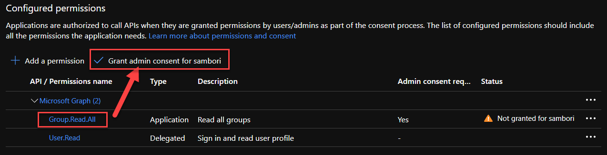

# Desarrollando MS Teams Messaging Extensions usando SPFx (M365 Dev Bootcamp 2020 Virtual)

En este laboratorio, vamos a ver como podemos desarrollar Messaging Extensions para MS Teams, utilizando SPFx para la mayor parte de la funcionalidad.

## (WIP) Indice

  - Introducción
  - Pre-requisitos: Azure subscription, Office 365 Tenant, SPFx, Yo Teams, ngrok...
  - Registrar Bot Channel: registrar, añadir Teams channel...
  - Crear Secret para la AAD App creada por el Bot Channel
  - Registrar Azure AD App para llamar a Graph desde el Bot
  - SPFx Webpart
  - Deploy SPFx webpart
  - Deploy Teams manifest
  - Crear Bot (actualizar ngrok URL en Bot Registration)
  - Funciona!

## Introducción

Antes de empezar con el laboratorio, si no se sabe lo que son Messaging Extensions, se recomienda la lectura del siguiente artículo: [https://docs.microsoft.com/en-us/microsoftteams/platform/messaging-extensions/what-are-messaging-extensions](https://docs.microsoft.com/en-us/microsoftteams/platform/messaging-extensions/what-are-messaging-extensions).

Básicamente, las messaging extensions nos van a permitir que el usuario de Teams, interactúe con acciones personalizadas, desde la misma applicación o web de Teams.

En este laboratorio vamos a desarrollar un _Action Command_ que va a permitir al usuario listar todos los Teams de la tenant (limitaremos a 20), seleccionar un Teams, y que la información principal de ese Team: título, descrición, imagen y link, se envíen por chat, como parte de la conversación. 

### Caso de uso del lab

El escenario que se pretende cubrir es el siguiente: Imaginemos que en una conversación de un Team, o en un chat con algún compañero, te preguntan donde pueden encontrar cierta información. Tú sabes qué Team es el adecuado, donde tu compañero puede buscar en sus documentos o conversaciones, así que usando la messaging extension, seleccionas el Team adecuado, y envías la info del Team al tu compañero, que desde el mismo chat, puede saltar a ese Team. La siguiente imagen representa el caso de uso descrito, y el resultado final de este lab.


## Pre Requisitos

Para completar el laboratorio, se requiere (recomendamos acudir al lab con esto ya instalado/configurado, de lo contrario, seguramente no dará tiempo a completar el lab):

- Suscripción de Azure con usuario Administrador de la misma
- Tenant de Office 365 con usuario Administrador de la misma
- Prepara tu Tenant para Teams development. Sigue estos pasos: [https://docs.microsoft.com/en-us/microsoftteams/platform/concepts/build-and-test/prepare-your-o365-tenant](https://docs.microsoft.com/en-us/microsoftteams/platform/concepts/build-and-test/prepare-your-o365-tenant)
- SPFx dev enviroment actualizado a la última versión (follow steps here: [https://docs.microsoft.com/en-us/sharepoint/dev/spfx/set-up-your-development-environment](https://docs.microsoft.com/en-us/sharepoint/dev/spfx/set-up-your-development-environment))
- [ngrok](https://ngrok.com/) instalado y configurado. Sigue estos pasos:
    - Crea una cuenta en la web de ngrok (es gratis)
    - Instala ngrok usando npm: 
        ```js 
        npm install ngrok -g   
        ```
    - Configura el Auth Token de ngrok (al crearte la cuenta, la web te dará esa información)
        ```js
        ngrok authtoken <YOUR_AUTHTOKEN>
        ```
- Visual Studio Code ... alguien no lo tiene?! :D
- Instala el generador para Teams de Yeoman:
    ```js
    npm install yo gulp-cli --global
    npm install generator-teams --global
    ```

## Registro del Bot Channel en Azure

A pesar de que la mayor parte de la funcionalidad de nuestra messaging extension se va a resolver en el lado de spfx (desarrollaremos un webpart de spfx tal cual, que funcionará dentro de Teams), a la hora de enviar información al control de "componer mensaje" de Teams, es necesario un bot que habilite el canal con MS Teams. Para ello, registraremos un Bot Channel en Azure.

Abrimos el portal de Azure, y seguimos los pasos descritos en la siguiente imagen:


Una vez creado, ve al recurso, y en la sección de __Channels__, habilita el canal para __Teams__


Ahora vamos a la sección de __Settings__ donde guardaremos el Identificador de la Azure Active Directory App que se ha registrado para nuestro bot, y clicaremos en el link de __Manage__, ya que necesitamos configurar algunas cosas de la AAD App.


Crea un nuevo Secret para la App, y guárdalo a buen recaudo junto al App ID


Vuelve a la pantalla de __Settings__ del Channel, porque luego necesitaremos actualizar el _messaging endpoint_, así que deja el navegador abierto en esa pantalla.

## Registrar Azure AD App para llamar a Graph desde el Bot

Es tiempo ahora de registar una nueva aplicación de Azure Active Directory, que nos va a servir para poder consumir datos de MS Graph API desde nuestro bot.
__Importante__: Esta nueva App, hay que registrarla en el Azure Active Directory de la Tenant de Office 365. El registro del Bot puede hacerse en cualquier suscripción de Azure, que puede estar en el mismo Directorio que la Tenant de Office 365, o no, de ahí que esta App se requira registar en el Directorio de la Tenant de Office 365, que es donde finalmente están los datos que queremos consumir a través de la Graph API.

Abrimos el portal de Azure de la Tenant de Office 365, vamos a la sección de __App Registrations__ y registramos una nueva Aplicación, tal y como muestra la imagen siguiente:


Una vez creada la App, guarda a buen recaudo el Client ID y Tenant ID:


Ahora necesitamos crear un nuevo __Secret__, que de nuevo guardaremos a buen recaudo para utilizar luego en nuestro código:


Finalmente, ya que el objetivo de esta AAD App es poder consumir información de Graph, en nuestro caso queremos listar los Teams de la Tenant, debemos asignar los permisos necesarios en Graph. Para ello saltamos a la sección __API Permissions__


Seleccionamos ahora permisos de Aplicación, y añadimos permisos para poder leer los Grupos de la Tenant.


Una vez añadido el permiso, y al ser éste de Aplicación, debemos dar consentimiento a nivel de Administrador, así que clicamos en el botón de __Grant Admin permissions__ y confirmamos el mensaje.




Llegado a este punto, es por fin momento de empezar con el código... acaso no es esto un Developer Bootcamp?!!

## List Teams SPFx Webpart

Vamos a crear nuestro Webpart de SPFx que luego registraremos como Teams messaging extension. Este webpart es donde se hará la mayor parte de la funcionalidad. En él, utilizando el Graph Http Client del propio framework, accederemos a la Graph API y sacaremos los 20 primeros Teams de la Tenant.

Antes de crear el Webpart, crea una carpeta que contendrá la solución completa, que incluye el webpart, y también el Bot.

```js
mkdir mge-spfx-lab
```

Y ahora crea otra carpeta para el proyecto del SPFx Webpart

```js
mkdir spfx-teams-webpart
```

Dentro de esta útlima carpeta, lanza el comando de Yeoman para crear el proyecto SPFx:

```js
yo @microsoft/sharepoint
```

Puedes dejar los valores por defecto que te va ofreciendo el asistente de Yeoman en casi todas las preguntas. Tan solo cambia el nombre del webpart, y asegúrate de elegir __React__ como framework. La siguiente imagen tiene todos los valores a asignar:


Después de 1 minuto (o 2), ya tendrás tu webpart creado, así que es momento de añadir la funcionalidad que queremos.

Primero de todo, añade unas nueva carpetas dentro de la carpeta __src__:
  - models

Dentro de esa carpeta, crea un ficher __IGraphTeam.ts__. Esta interfaz va a modelar la información que necesitaremos de un Team: nombre, descripción, imagen, y poco más.

Así que añade el siguiente código a dicho fichero:

```ts
export interface IGraphTeam {
  id: string;
  displayName: string;
  description: string;
  thumbnailUrl: string;
}
```

Haciendo uso de la "componentización", nuestro webpart de SPFx estará compuesto por los siguientes componente de React:


  - __TeamsListWebPart__: es el webpart propiamente dicho. Su trabajo es inicializar ciertas cosas relacionadas con el mismo framework de SPFx, como por ejemplo la librería del PnPJS, o determinar si estamos corriendo en el contexto de una Teams messaging extension (recuerda que al ser un webpart, éste podría correr perfectamente en una página de SharePoint, o una Tab de Teams, y en ese caso, la funcionalidad estaría limitada). Además, inicializa el componente hijo, pasando las _props_ necesarias (por ejemplo el contexto de Teams).
  - __TeamsList__: Este sería lo que React un llama _Smart Component_. Se encarga de sacar los datos llamando a la API de Graph, y pasar estos datos a su componente hijo. También se encarga de renderizar un mensaje de carga de datos, mientras los datos no han sido obtenidos (el típico _spinner_ de "_Loading data_")
  - __AllTeams__: este componente ya renderiza los datos como una lista de componentes TeamDetail
  - __TeamDetail__: este componente renderiza la información de un Team concreto, además de realizar la acción de "_Share Team_", que llamará al Bot para que la información del Team se incruste en el chat de MS Teams.

Siendo así, vamos a crear los siguientes nuevos ficheros dentro de la carpeta __components__:

__ITeamsListState.ts__

Define el estado del componente ITeamsListState, que basicamente será una lista de Teams. Añadimos el siguiente código al archivo:

```ts
import { IGraphTeam } from "../../../models/IGraphTeam";

export interface ITeamsListState {
  teams: IGraphTeam[];
}
```

Para dar el _look and feel_ deseado, vamos a editar el ficher existente __TeamsList.module.scss__ con el siguiente código:

```css
@import '~office-ui-fabric-react/dist/sass/References.scss';

.teamsList {
  .image {
    display: block;
    border: 0;
    width: 100%;
    height: auto;
  }

  .cards {
    display: flex;
    flex-wrap: wrap;
    justify-content: space-between;
 }

  .card {
    /* Add shadows to create the "card" effect */
    box-shadow: 0 4px 8px 0 rgba(0,0,0,0.2);
    transition: 0.3s;
    flex: 0 1 calc(35% - 1em);
  }

  /* On mouse-over, add a deeper shadow */
  .card:hover {
    box-shadow: 0 8px 16px 0 rgba(0,0,0,0.2);
  }

  /* Add some padding inside the card container */
  .container {
    padding: 2px 16px;
  }
}
```

Seguimos con el componente de más abajo de la jerarquía. Añade el fichero __TeamDetail.tsx__ con el siguiente código:

```ts
import * as React from 'react';

import styles from './TeamsList.module.scss';
import { IGraphTeam } from '../../../models/IGraphTeam';
import { IIconProps } from 'office-ui-fabric-react/lib/components/Icon/Icon.types';
import { ActionButton } from 'office-ui-fabric-react/lib/components/Button/ActionButton/ActionButton';
import { IMicrosoftTeams } from '@microsoft/sp-webpart-base';

export interface IGroupDetailProps {
  group: IGraphTeam;
  isTeamsMessagingExtension?: boolean;
  teamsContext?: IMicrosoftTeams;
}

export interface IGroupDetailState {}

export default class GroupDetail extends React.Component<IGroupDetailProps, IGroupDetailState> {

  private groupClicked = (group: IGraphTeam): void => {
    console.log("About to share group info", group);
    if (this.props.isTeamsMessagingExtension) {
      this.props.teamsContext.teamsJs.tasks.submitTask(group);
    }
  }

  public render(): React.ReactElement<IGroupDetailProps> {

    const shareIcon: IIconProps = { iconName: 'Share' };

    return (
      <div className={styles.card}>
        </img>
        <div className={styles.container}>
          <h4><b>{this.props.group.displayName}</b></h4>
          <p>{this.props.group.description}</p>
          <div>
          <ActionButton
            iconProps={shareIcon}
            key={this.props.group.id}
            onClick={() => this.groupClicked(this.props.group)}>Share Team</ActionButton>
          </div>
        </div>
      </div>
    );
  }
}
```

Échemos un vistazo a las partes más importantes.

El método __render__ no tiene mucho misterio, tan solo algunos DIVs para pintar la info del Teams (título, imagen, etc). Hacemos uso de algunos componentes del FluentUI, como el __ActionButton__, y cuando el botón se clica, lo que hacemos es enviar la información del Team, al Bot que está a la escucha. Esto lo hacemos a través del mismo framework de spfx, con el método __submitTask__:

```ts
    if (this.props.isTeamsMessagingExtension) {
      this.props.teamsContext.teamsJs.tasks.submitTask(group);
    }
```

Vamos ahora a crear un nuevo fichero llamado __AllTeams.tsx__ con el siguiente código:

```ts
import * as React from 'react';
import styles from './TeamsList.module.scss';

import { IGraphTeam } from "../../../models/IGraphTeam";
import TeamDetail from './TeamDetail';
import { IMicrosoftTeams } from '@microsoft/sp-webpart-base';

export interface IAllTeamsProps {
  teams: IGraphTeam[];
  isTeamsMessagingExtension?: boolean;
  teamsContext?: IMicrosoftTeams;
}

export interface IAllTeamsState {}

export default class AllTeams extends React.Component<IAllTeamsProps, IAllTeamsState> {
  public render(): React.ReactElement<IAllTeamsProps> {

    const teams = this.props.teams.map(team => {
      return <TeamDetail
        group={team}
        isTeamsMessagingExtension={this.props.isTeamsMessagingExtension}
        teamsContext={this.props.teamsContext} />;
    });

    return (
      <div className={styles.teamsList}>
        <div className={styles.cards}>
          {teams}
        </div>
      </div>
    );
  }
}
```

No mucho que destacar en el codigo anterior, simplemente iteramos los Teams que recibe el componente en sus _props_, y pintamos cada Team a traves del componente _TeamDetail_

Pasamos ahora a editar el componente __TeamsList.tsx__, que hara el trabajo de obtener los Teams a partir de la Graph API.

Para acceder a Graph, vamos a hacerlo a traves de la genial libreria [PnP JS](https://pnp.github.io/pnpjs/), que si no la conoceis, o quereis profundizar mas de lo que vamos a ver ahora, os recomiendo que veais manana la sesion que tengo sobre ella:
__Todo sobre PnP JS y PnP React components__: Miercoles 11, a las 17h en Room 1

Primero necesitamos instalar la libreria del PnP, que se compone de diferentes modulos, asi que instalaremos los necesarios para acceder a Graph, que son:

```js
npm install @pnp/logging @pnp/common @pnp/odata @pnp/graph --save
```

Editamos la clase __TeamsList__ con la siguiente definicion:

```ts
export default class TeamsList extends React.Component<ITeamsListProps, ITeamsListState> {
```

Definimos el constructor de la clase, donde inicializamos el estado del componente:

```ts
constructor(props: ITeamsListProps) {
    super(props);

    this.state = {
      teams: []
    };
}
```

Ahora sobrescribimos el método del ciclo de vida del componente React __componentDidMount__, para que obtengamos los Teams a través de la Graph API, usando la librería del PnP JS que hemos instalado anteriormente.

```ts
  public componentDidMount(): void {
    graph.groups
      .setEndpoint("beta")
      .top(20)
      .select("id, displayName, description")
      .filter("resourceProvisioningOptions/Any(x:x eq 'Team')") // only Teams: https://docs.microsoft.com/en-us/graph/teams-list-all-teams#get-a-list-of-groups-using-beta-apis
      .get()
      .then((teams) => {
        this.setState({
          teams: teams.map((team: IGraphTeam, index: number) => {
            index += 10;
            return {
              displayName: team.displayName,
              id: team.id,
              description: team.description,
              thumbnailUrl: `https://picsum.photos/id/${index}/200/100`,
            };
          }),
        });
      });
  }
```

Al copiar el código anterior, debemos importar el objeto _graph_:

```ts
import { graph } from "@pnp/graph/presets/all";
```

Vamos a deternos aquí y revisar el código que tenemos en el _componentDidMount_. Utilizamos el objeto _graph_ del PnP JS, que nos da acceso al Endpoint de Groups de MS Graph (al final los Teams son también grupos de Office 365), establecemos el endpoint Beta, pues que el _filter_ que estamos especificando, sólo está disponible en el beta endpoint de Graph. Dicho filter nos va a devolver sólo aquellos grupos que son Teams, luego obtenemos los primeros 20 Teams, y seleccionamos sólo los campos _id_, _displayName_ y _description_. Una vez obtenemos la _response_ de Graph, actualizamos el _state_ del componente con los Teams obtenidos. Como te habrás dado cuenta, para la imagen estamos usando una imagen aleatoria que nos devuelve la web _picsum_. La cosa es que para obtener la foto del Team, tendríamos que hacer otra petición a Graph, así que por simplicidad, lo vamos a dejar así (sería un ejercicio interesante para aquellos que completéis el lab antes de tiempo :D).

Antes de cambiar el _render_ del componente, vamos a definir algunas _props_ extras que este componente va a recibir del webpart.

Edita el fichero __ITeamsListProps.ts__ con el siguiente código:

```ts
import { IMicrosoftTeams } from "@microsoft/sp-webpart-base";

export interface ITeamsListProps {
  isTeamsMessagingExtension?: boolean;
  teamsContext?: IMicrosoftTeams;
}
```

Lo que estamos haciendo aquí es que el webpart pasará al __TeamsList__, component un par de propiedades:
  - __isTeamsMessagingExtension__: nos indicará si el webpart spfx está corriendo como messaging extension en Teams.
  - __teamsContext__: este objeto viene del propio framework spfx, y tiene objetos y propiedades relacionadas con el contexto de Teams en el que corre el webpart.

Vuelve ahora al fichero __TeamsList.tsx__ para editar el método _render_ con el siguiente código:

```ts
  public render(): React.ReactElement<ITeamsListProps> {
    if(this.state.teams.length <= 0) {
      return(
        <Shimmer
          shimmerElements={[
            { type: ShimmerElementType.line, width: 246, height: 246 },
            { type: ShimmerElementType.gap, width: '2%' },
            { type: ShimmerElementType.line, width: 246, height: 246 },
            { type: ShimmerElementType.gap, width: '2%' },
            { type: ShimmerElementType.line, width: 246, height: 246 },
            { type: ShimmerElementType.gap, width: '2%' },
            { type: ShimmerElementType.line, width: '100%', height: 246 }
          ]}
        />
      );
    }

    return (
      <AllTeams
        teams={this.state.teams}
        isTeamsMessagingExtension={this.props.isTeamsMessagingExtension}
        teamsContext={this.props.teamsContext} />
    );
  }
```

Poco que contar en el _render_, simplemente comprobamos si los datos de Graph se han recibido ya, si no es el caso, mostramos un _Shimmer_ (podéis ver lo que hace este control [aquí](https://developer.microsoft.com/en-us/fluentui#/controls/web/shimmer)), que indica al usuario que los datos se están cargando. Si los datos ya se han cargado, renderizamos el componente de React que se encarga de pintar todos los Teams recibidos.

Para finalizar nuestro webpart, vamos a editar el fichero __TeamsListWebPart.ts__ (el webpart en sí), ya que necesitamos hacer bastantes cambios. Primero de todo, como nuestros componentes están haciendo uso de los Iconos de la librería _FluentUI_, necesitamos un pequeño workaround para que dichos iconos se muestren correctamente cuando el webpart se ejecuta dentro de Teams (cuando corre en SharePoint, esto no es necesario, pero sí para Teams). Para dicho workaround, necesitamos importar la función _initializeIcons_ de la propia librería _FluentUI_ (antiguamente conocida como OfficeUI Fabric).

```ts
import { initializeIcons } from 'office-ui-fabric-react';
```

Ahora, definimos una propiedad privada al webpart, que daremos el valor de si el webpart se está ejecutando como Teams messaging extension o no:

```ts
private isTeamsMessagingExtension: boolean;
```

Seguidamente, vamos a definir el método __onInit__ del webpart, ya que necesitamos inicializar la librería del PnP JS aquí, los iconos de _FluentUI_ que mencionamos antes, además de dar valor a la propiedad _isTeamsMessagingExtension_.

```ts
public onInit(): Promise<void> {

    initializeIcons();

    this.isTeamsMessagingExtension = (this.context as any)._host &&
                                      (this.context as any)._host._teamsManager &&
                                      (this.context as any)._host._teamsManager._appContext &&
                                      (this.context as any)._host._teamsManager._appContext.applicationName &&
                                      (this.context as any)._host._teamsManager._appContext.applicationName === 'TeamsTaskModuleApplication';

    console.log("isTeamsMessagingExtension", this.isTeamsMessagingExtension);

    return super.onInit().then(_ => {
      graph.setup({
        spfxContext: this.context
      });
    });
  }
```

Importamos la clase _graph_

```ts
import { graph } from '@pnp/graph';
```

Vamos a ver qué estamos haciendo en ese __onInit__:
  - Primero llamamos al _initializeIcons_ para resolver el tema de los iconos que ya hemos comentado.
  - Luego damos valor a la variable que nos dice si el webpart está corriendo como Teams messaging extension. Para ello tenemos que inspeccionar el _applicationName_ que está bastante escondido dentro del contexto del webpart (a mi esto me parece un poco _hack_, y supongo que lo harán mejor en posteriores versiones, ya que el objeto _"_host"_ ni si quiera lo han tipado, y siendo que el nombre de la propiedad lo han prefijado con "_", indica que la idea era hacerlo "oculto". Pero bueno, de momento es la documentación oficial de MS)
  - Inicializamos la librería de PnP JS, invocando su método _setup_, pasando el contexto del webpart.

Ya sólo queda cambiar ligeramente el _render_ del webpart, para pasar las propiedades que el componente _TeamsList_ está esperando.

```ts
  public render(): void {
    const element: React.ReactElement<ITeamsListProps> = React.createElement(
      TeamsList,
      {
        teamsContext: this.context.sdks.microsoftTeams,
        isTeamsMessagingExtension: this.isTeamsMessagingExtension
      }
    );

    ReactDom.render(element, this.domElement);
  }
```

Llegado a este punto, hemos cumplido nuestra primera _milestone_, así que es momento de ver qué tal vamos, y ejecutar nuestro webpart en el mismo SharePoint workbench. Para ello, vete a la consola de comandos, dentro de la carpeta raíz del webpart spfx, y lanza:

```js
gulp serve --nobrowser
```

Si no tienes ningún error en la consola, abre cualquier TeamSite en SharePoint, y añade "/_layouts/workbench.aspx" para cargar el SharePoint Workbench. Por ejemplo:

```js
https://[TENANT].sharepoint.com/sites/[YOUR SITE]/_layouts/workbench.aspx
```

En el workbench, agrega el webpart _TeamsList_ a la página. Si todo ha ido bien, deberás obtener un listado con algunos de los MS Teams teams de tu Tenant (obviamente asegúrate de que tu Tenant tiene algunos Teams de MS Teams creados).

## Desplegando el webpart en SharePoint
Asumo que ya tienes cierta experiencia con spfx y sabes como hacer el deploy del webpart. Si no es el caso, aquí tienes las instrucciones con detalle de cómo hacerlo [https://docs.microsoft.com/en-us/sharepoint/dev/spfx/web-parts/get-started/serve-your-web-part-in-a-sharepoint-page](https://docs.microsoft.com/en-us/sharepoint/dev/spfx/web-parts/get-started/serve-your-web-part-in-a-sharepoint-page). 

__Nota__: Cuando generamos el webpart con Yeoman, dejamos por defecto un valor que no era el correcto, y que hará que nuestro webpart no funcione dentro de Teams. Para corregir esto, editar el fichero: __\config\package-solution.json__ y añade lo siguiente, dentro del nodo __solution__ 

```json
"skipFeatureDeployment": true,
```

Una vez hecho esto, ya puedes seguir con el deploy. En resumen:

  - Compila y empaqueta tu webpart para producción:
  ```js
    gulp bundle --ship && gulp package-solution --ship
  ```
  - Sube y despliega el fichero _.sppkg_ al App Catalog de tu SharePoint. Si todo ha ido bien, tendrás una carpeta _sharepoint\solution_ con un fichero con extensión __.sppkg__.
  - Si ahora quieres, puedes instalar la App en cualquier TeamSite, y añadir el webpart a una de sus páginas. No es necesario para lo que queremos hacer.

## Desplegando el webpart en Teams

Ahora empieza lo defícil :D. Tenemos que decirle a nuestro webpart, que puede funcionar como Teams messaging extension. Para ello, tenemos que crear un _manifest_ para Teams, para ello, dentro de la carpeta __teams__ del webpart, añade un nuevo fichero con nombre __manifest.json__. Puedes usar el siguiente ejemplo, y modificar los valores que pongo entre doble asterisco y en mayúsculas ** EJEMPLO ** (haz una búsqueda por doble asterisco para asegurarte que no se te pasa ninguno):

```json
{
  "$schema": "https://developer.microsoft.com/en-us/json-schemas/teams/v1.7/MicrosoftTeams.schema.json",
  "manifestVersion": "1.7",
  "version": "1.0.0",
  "id": "** CREA UN NUEVO GUID **",
  "packageName": "com.bootcamp.teams.shareTeam",
  "developer": {
    "name": "M365 Dev Bootcamp",
    "websiteUrl": "https://github.com/CompartiMOSS/Microsoft-365-Developer-Bootcamp-Virtual/tree/master/TeamsMessagingExtensionsWithSpfx",
    "privacyUrl": "https://github.com",
    "termsOfUseUrl": "https://github.com"
  },
  "icons": {
    "color": "** TIENES EL FICHERO EN LA MISMA CARPETA, COPIA SU NOMBRE -> 8a09d673-6d69-4023-851d-26bfe2302f44_color.png",
    "outline": "** TIENES EL FICHERO EN LA MISMA CARPETA, COPIA SU NOMBRE -> 8a09d673-6d69-4023-851d-26bfe2302f44_outline.png"
  },
  "name": {
    "short": "M365Bootcamp Teams Bot",
    "full": "M365Bootcamp Teams messaging extensions for Teams"
  },
  "description": {
    "short": "M365Bootcamp Teams messaging extensions for Teams",
    "full": "This messaging extensions allows you to search for a MS Teams team, and send the information into the chat window"
  },
  "accentColor": "#FFFFFF",
  "composeExtensions": [
    {
      "botId": "** ESTE ES EL ID DE LA APP CREADA CUANDO REGISTRATE EL BOT CHANNEL **",
      "canUpdateConfiguration": true,
      "commands": [
        {
          "id": "shareTeam",
          "type": "action",
          "title": "Share Team info",
          "description": "Find and share a Team",
          "initialRun": false,
          "fetchTask": false,
          "context": [
            "commandBox",
            "compose"
          ],
          "taskInfo": {
            "title": "Share a Team",
            "width": "700",
            "height": "600",
            "url": "https://{teamSiteDomain}/_layouts/15/TeamsLogon.aspx?SPFX=true&dest=/_layouts/15/teamstaskhostedapp.aspx%3Fteams%26personal%26componentId=**GUID DE TU WEBPART (lo tienes en el manifest del propio webpart: TeamsListWebPart.manifest.json)**%26forceLocale={locale}"
          }
        }
      ]
    }
  ],
  "permissions": [
    "identity",
    "messageTeamMembers"
  ],
  "validDomains": [
    "*.login.microsoftonline.com",
    "*.sharepoint.com",
    "*.sharepoint-df.com",
    "spoppe-a.akamaihd.net",
    "spoprod-a.akamaihd.net",
    "resourceseng.blob.core.windows.net",
    "msft.spoppe.com"
  ],
  "webApplicationInfo": {
    "resource": "https://{teamSiteDomain}",
    "id": "00000003-0000-0ff1-ce00-000000000000"
  }
}
```

Una vez editado el manifest, lo siguiente es hacer un .zip de los 3 ficheros de la carpeta _teams_ (el manifest.json y los 2 .png). Asegúrate de comprimir los 3 ficheros, y NO la carpeta _teams_

Con ese .zip, vamos a desplegarlo en MS Teams. Para ello, abre la web de Teams: [https://teams.microsoft.com/](https://teams.microsoft.com/), y pincha en el icono "Apps"


Selecciona el fichero .zip que has generado.


Si todo ha ido bien, ahora puedes ir a una conversación de un chat o un Team, y verás que en el control donde escribes, aparece el botón de nuestra messaging extension, y si pinchamos, aparece un pop-up con el listado de nuestros Teams!!


Sin embargo, si pinchamos en "Share Team", obtendremos un error, de que la App no se ha podido alcalnzar. Esto es totalmente esperado en este punto, ya que necesitamos completar la segunda parte del Lab, donde crearemos un Bot, que recogerá el mensaje lanzado por nuestro webpart de SPFx, junto con la info de un Team, y compondrá el mensaje en el cuadro del chat. En otras palabras, a día de hoy, el webpart spfx no es capaz de componer un mensaje en el chat, y necesita que un Bot procese su acción.

Vamos a crear ese Bot!!

## Creación del Bot para nuestra Messaging Extension

Podemos crear un Bot para MS Teams en diferentes lenguajes y plataformas. Quiza la mas sencilla para principiantes sea utilizar otro _generator_ de Yeoman, de nombre __Yo Teams__, que ya instalamos al principio del Lab, como parte de los pre requisitos.

En una aplicacion de consola, crea una carpeta nueva a la misma altura del proyecto spfx (si seguiste los pasos iniciales, debes tener una carpeta principal llamada _mge-spfx-lab_), por ejemplo:

```
mkdir bot-teams-mge
```

Situate en esta nueva carpeta, y vamos a crear el proyecto del Bot utilizando _Yo teams_:

```
yo teams
```

Puedes dejar practicamente todos los valores sugeridos por la plantilla. El unico valor a cambiar, es el __Microsoft App ID__, que tiene que ser el App Id obtenido al registrar el __Bot Channel__. Podeis ver a cual me refiero en la imagen siguiente:


