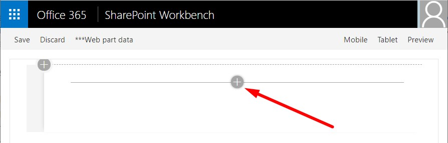
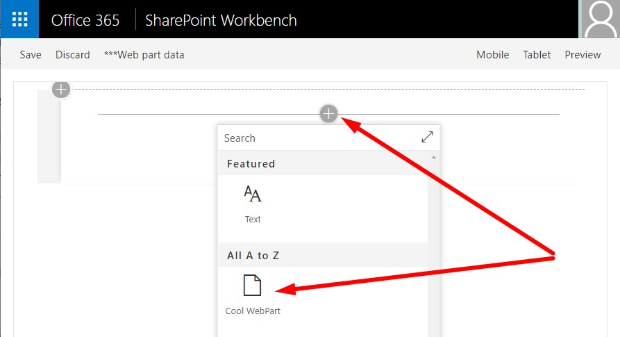
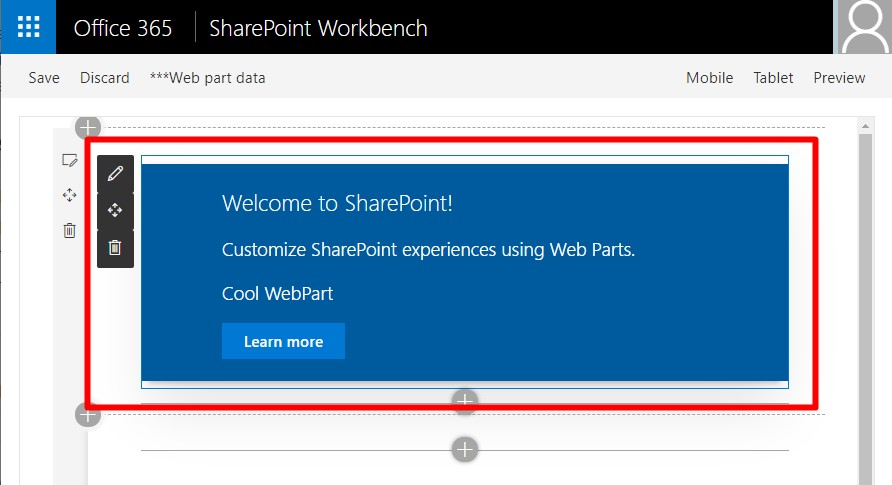
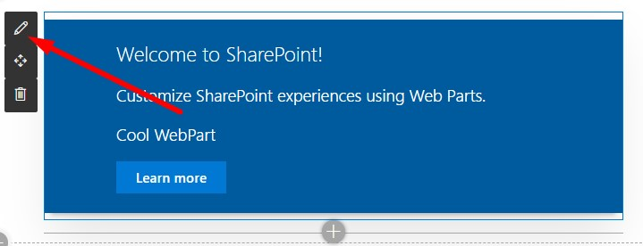
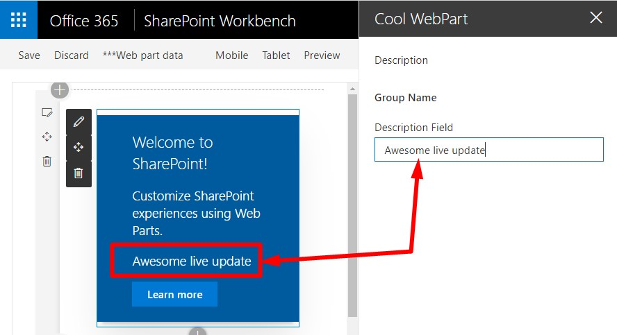

# SPFx Webpart

## Creación de un webpart SPFx

1. Abriremos la consola de comandos y navegaremos a la carpeta donde queremos crear nuestro proyecto.

1. Ejecutaremos Yeoman con el siguiente comando:

    ```shell
    yo @microsoft/sharepoint
    ```

    Crearemos el webpart con la información que indicamos a continuación:

    * **What is your solution name?**: CoolWebPart
    * **Which baseline packages do you want to target for your component(s)?**: SharePoint Online only (latest)
    * **Where do you want to place the files?**: Create a subfolder with solution name
    * **Do you want to allow the tenant admin the choice of being able to deploy the solution to all sites immediately without running any feature deployment or adding apps in sites?**: No
    * **Will the components in the solution require permissions to access web APIs that are unique and not shared with other components in the tenant?**: No    
    * **Which type of client-side component to create?**: WebPart
    * **What is your Web part name?**: CoolWebPart
    * **What is your Web part description?**: Cool Web Part developed for M365 Developer Bootcamp 2020
    * **Which framework would you like to use?**: React

    Una vez se haya provisionado la estructura de carpetas requerida para el proyecto, el generador se descargará toda la dependencia de paquetes a través de NPM, acción que tardará unos minutos

1. Una vez creado el webpart, abrimos Visual Studio Code con el comando:

   ```shell
   code .
   ```

## Probar el webpart

En caso de no haber instalado el certificado de desarrollador durante la etapa de preparación del entorno de desarrollo, debemos hacerlo ahora, __una única vez__. Para ello ejecutamos el siguiente comando en la carpeta donde esté nuestra solución SPFx. Si ya lo tenemos instalado, podemos simplemente ignorar este paso.
    
```shell
gulp trust-dev-cert
```

Posteriormente ejecutaremos el proyecto con el siguiente comando:

```shell
gulp serve
```

La tarea _serve_ de Gulp lo que hará será ejecutar el proyecto, arrancando un servidor web local y abriendo un navegador con el Workbench de SharePoint:



Seleccionamos el icono de webpart para abrir la lista de webparts disponibles.



Seleccionamos el webpart que acabamos de crear: **HelloWorld**.



Editamos las propiedades del webpart pinchando en el lápiz en la barra de la izquierda del webpart.



En el panel de propiedades que se abre, modificaremos el valor del campo **Description Field**. Podremos observar que el webpart se va actualizando a medida que el texto se va cambiando.



Para finalizar, cerraremos el navegador y pararemos el servidor local pulsando <kbd>CTRL</kbd>+<kbd>C</kbd> en la consola de comandos.


## ENLACES

[INDEX](./readme.md)

[0.- Development environment](./environment.md)

1.- SPFx Webpart

[2.- SPFx Design](./spfx-design.md)