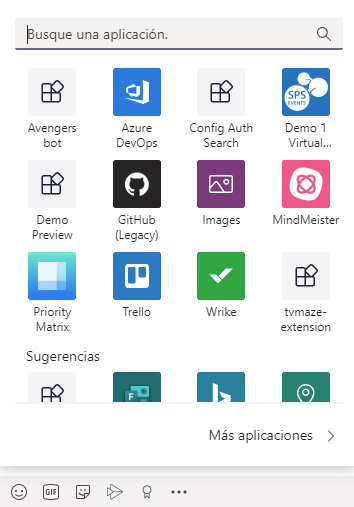
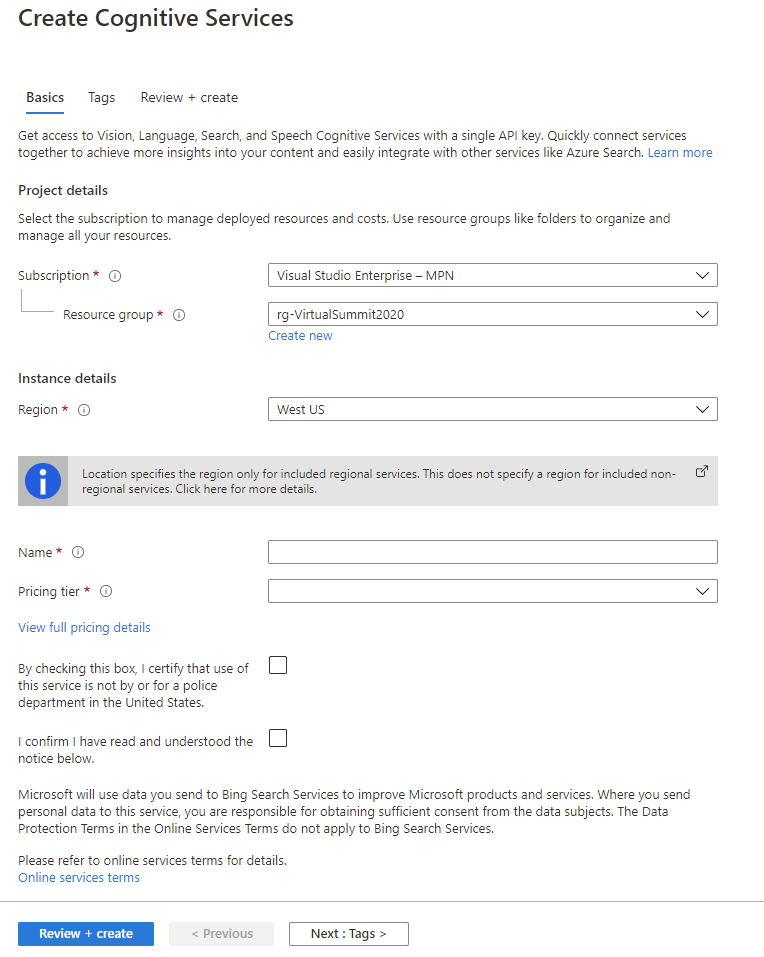
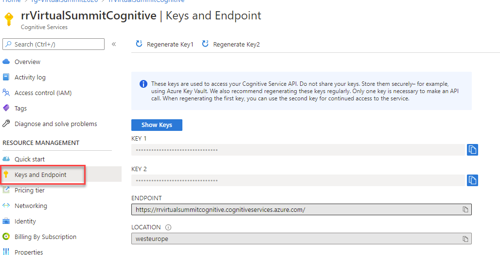
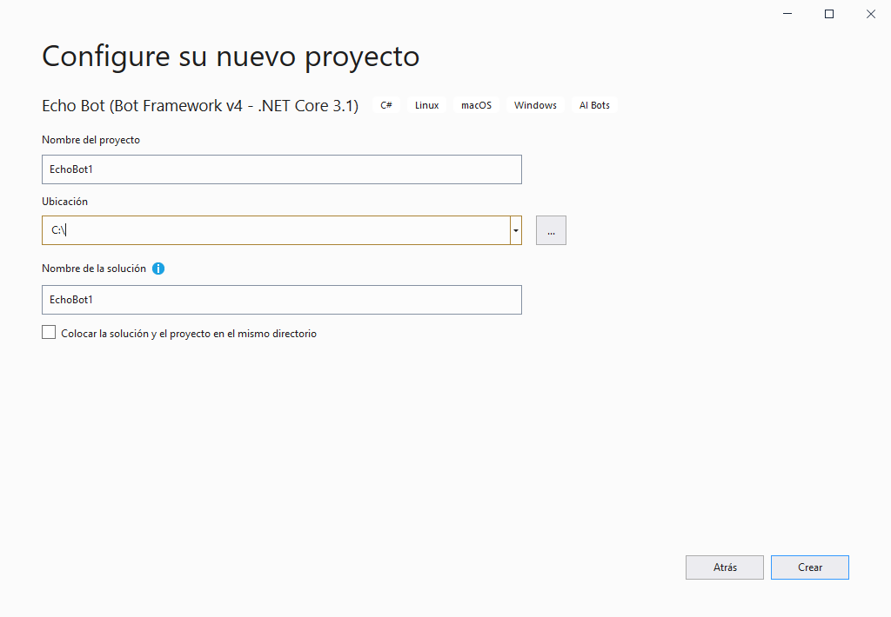
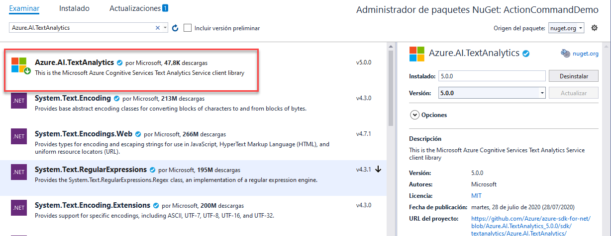

# Teams Messaging Extensions Command Actions

## Descripción

En este laboratorio vamos a ver como crear comandos de acción para la extensión de mensajeria, para ello vamos a hacer 2 ejemplos:

- En el primer ejemplo vamos a crear un comando que podamos ejecutar al crear un mensaje, nos pida un valor y nos muestre el resultado de la ejecución.

    

- En el segundo ejemplo vamos a ver como crear un comando que podamos ejecutar a un mensaje que ya exista dentro de la conversación

    

## Creando un servicio cognitivo en Azure

Nuestro proyecto va a utilizar el servicio de analisis de sentimiento de Azure, por lo que necesitamos crear este recurso en el portal de Azure.

1. Abre el [portal de Azure](https://portal.azure.com/)

1. Añade un nuevo recurso desde la home

    

    También puedes hacerlo desde el grupo de recursos donde quieres crearlo

    

1. Selecciona Cognitive Services

1. Selecciona el grupo de recursos, región, nombre y el plan de precios

    

1. Crea el recurso pulsando Review + Create y luego Create

1. Una vez creado el recurso necesitaremos 2 valores que tendremos que introducir en nuestra solución, el endpoint y una key. Los dos valores los podemos ver dentro de la pestaña Keys and Endpoint

    

## Creando la solución en Visual Studio

1. Abre Visual Studio

1. Crea un proyecto con la plantilla "Echo Bot(Bot Framework v4 - .NET Core 3.1)

    

1. Añade el nombre del proyecto, la ubicación y el nombre de la solución

    

1. Abre el fichero appsetings.json e introduce los valores del registro del bot en Azure

    ```
    {
        "MicrosoftAppId": "[clientId]",
        "MicrosoftAppPassword": "[clientSecret]"
    }
    ```

1. Abre el fichero Bots -> EchoBot.cs 

1. Añade el siguiente using

    ```
    using Microsoft.Bot.Builder.Teams;
    ```

1. Modifica la línea

    ```
    public class EchoBot : ActivityHandler
    ```

    por

    ```
    public class EchoBot : TeamsActivityHandler
    ```

1. Elimina el código generado de la clase

## Creando el servicio para el análisis de sentimiento

1. En Dependencias, añade el paquete de Nuget Azure.AI.TextAnalytics

    

1. Modifica el fichero appsettings.json para incluir la configuración del servicio cognitivo. El fichero tiene que quedar de esta forma

    ```
    {
        "MicrosoftAppId": "[clientId]",
        "MicrosoftAppPassword": "[clientSecret]"
        "CognitiveService": {
            "Endpoint": "[endpoint]",
            "Key": "[key]"
        }
    }
    ```

1. Crear una nueva carpeta Model

1. Dentro de la carpeta crea una clase SentimentResult.cs

1. Abre el fichero SentimentResult.cs y añade el siguiente código

    ```
    public class SentimentResult
    {
        public string Sentiment { get; set; }
        public string Image { get; set; }
    }
    ```

1. Crea una nueva carpeta Services en la raiz del proyecto

1. Dentro de la carpeta Services crea una clase AnalyzeSentimentService.cs

1. Añade el siguiente using

    ```
    using Azure;
    using Azure.AI.TextAnalytics;
    using [namespace de tu solución].Models;
    using Microsoft.Extensions.Options;
    ```

1. Añade una clase que almacenará la configuración del servicio. Esta clase la podemos crear en otro fichero, pero por simplicidad la creamos en el fichero AnalyzeSentimentService.cs

    ```
    public class CognitiveServiceSettings
    {
        public string Endpoint { get; set; }
        public string Key { get; set; }
    }
    ```

1. Añade una propiedad a la clase AnalyzeSentimentService para almacenar la configuración del servicio

    ```
    private readonly CognitiveServiceSettings _settings;
    ```

1. Crea un constructor que reciba esos parametros

    ```
    public AnalyzeSentimentService(IOptions<CognitiveServiceSettings> settings)
        {
            _settings = settings.Value;
        }
    ```

1. Crea el método CheckSentiment

    ```
    public SentimentResult CheckSentiment(string text)
        {
            string endpoint = _settings.Endpoint;
            string apiKey = _settings.Key;

            var client = new TextAnalyticsClient(new Uri(endpoint), new AzureKeyCredential(apiKey));

            DocumentSentiment docSentiment = client.AnalyzeSentiment(text);

            var result = new SentimentResult
            {
                Sentiment = docSentiment.Sentiment.ToString()
            };

            switch (docSentiment.Sentiment.ToString().ToLower())
            {
                case "positive":
                    result.Image = "https://thumbs.gfycat.com/ParallelGraciousJay-size_restricted.gif";
                    break;
                case "neutral":
                    result.Image = "https://reygif.com/media/enanito-dormilon-82183.gif";
                    break;
                case "negative":
                    result.Image = "https://i.imgur.com/wsKIXwE.gif";
                    break;
            }

            return result;
        }
    ```

1. Dentro del método ConfigureServices de Startup.cs añadimos las siguientes líneas para configurar nuestro servicio

    ```
    services.AddOptions();
    var section = Configuration.GetSection("CognitiveService");
    services.Configure<CognitiveServiceSettings>(section);
    services.AddTransient<AnalyzeSentimentService>();
    ```

## Creando el bot

1. Abrimos el fichero Bots -> EchoBot.cs
1. Añadimos los siguientes usings
    ```
    using [namespace].Models;
    using [namespace].Services;
    ```

1. Añadimos una propiedad con nuestro servicio y creamos un constructor que lo reciba
    ```
    private AnalyzeSentimentService _sentimentService;

    public EchoBot(AnalyzeSentimentService sentimentService)
    {
        _sentimentService = sentimentService;
    }
    ```

1. Creamos el método que llamara el servicio del bot al ejecutar la acción
    ```
    protected override async Task<MessagingExtensionActionResponse> OnTeamsMessagingExtensionSubmitActionAsync(ITurnContext<IInvokeActivity> turnContext, MessagingExtensionAction action, CancellationToken cancellationToken)
    {
        switch (action.CommandId)
        {
            // These commandIds are defined in the Teams App Manifest.
            case "dailySentiment":
                return DailySentimentCommand(turnContext, action);

            case "checkSentiment":
                return CheckSentimentCommand(turnContext, action);
            default:
                throw new NotImplementedException($"Invalid CommandId: {action.CommandId}");
        }
    }
    ```

1. Creamos el método DailySentimentCommand, que es el que se ejutará cuando ejecutamos la acción al crear un mensaje en el chat
    ```
    private MessagingExtensionActionResponse DailySentimentCommand(ITurnContext<IInvokeActivity> turnContext, MessagingExtensionAction action)
    {
        var data = ((JObject)action.Data).ToObject<SentimentResult>();

        var sentiment = _sentimentService.CheckSentiment(data.Sentiment);

        var card = new HeroCard
        {
            Title = $"I feel {sentiment.Sentiment}",
            Images = new List<CardImage>
            {
                new CardImage { Url = sentiment.Image },
            },
            Text = data.Sentiment,
        };

        var attachments = new List<MessagingExtensionAttachment>();
        attachments.Add(new MessagingExtensionAttachment
        {
            Content = card,
            ContentType = HeroCard.ContentType,
            Preview = card.ToAttachment(),
        });

        return new MessagingExtensionActionResponse
        {
            ComposeExtension = new MessagingExtensionResult
            {
                AttachmentLayout = "list",
                Type = "result",
                Attachments = attachments,
            },
        };
    }
    ```

1. Creamos el método CheckSentimentCommand, que es el que se ecutará cuando ejecutamos la acción desde un mensaje ya creado

    ```
    private MessagingExtensionActionResponse CheckSentimentCommand(ITurnContext<IInvokeActivity> turnContext, MessagingExtensionAction action)
    {
        var heroCard = new HeroCard
        {
            Title = $"{action.MessagePayload.From?.User?.DisplayName} orignally sent this message:",
            Text = action.MessagePayload.Body.Content,
        };

        var sentiment = _sentimentService.CheckSentiment(action.MessagePayload.Body.Content);

        var includeImage = ((JObject)action.Data)["showImage"]?.ToString();
        if (string.Equals(includeImage, bool.TrueString, StringComparison.OrdinalIgnoreCase))
        {
            heroCard.Images = new List<CardImage>
            {
                new CardImage { Url = sentiment.Image },
            };
        }

        return new MessagingExtensionActionResponse
        {
            ComposeExtension = new MessagingExtensionResult
            {
                Type = "result",
                AttachmentLayout = "list",
                Attachments = new List<MessagingExtensionAttachment>()
                {
                    new MessagingExtensionAttachment
                    {
                        Content = heroCard,
                        ContentType = HeroCard.ContentType,
                        Preview = heroCard.ToAttachment(),
                    },
                },
            },
        };
    }
    ```

## Creando el paquete de la solución

1. Crea una carpeta en tu solución que se llame TeamsAppManifest

1. Copia los ficheros que se encuentran en la carpeta actionCommandManifest de este laboratorio en la carpeta que acabamos de crear

1. Abre el fichero manifest.json y modifica [botId] por el id del registro de tu bot

1. Crea un fichero .zip con los 3 ficheros que hay en la carpeta

1. Una vez creado el fichero zip sigue las instrucciones para [desplegarlo en Teams](/setup/teamsLoading.md)