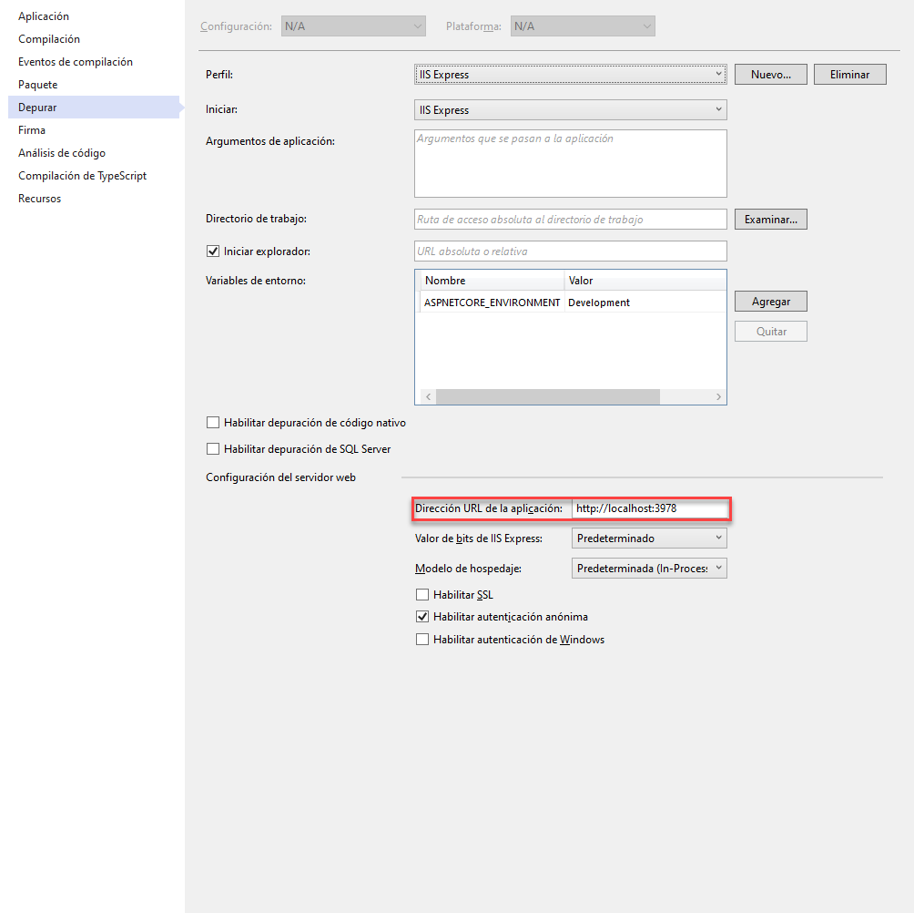
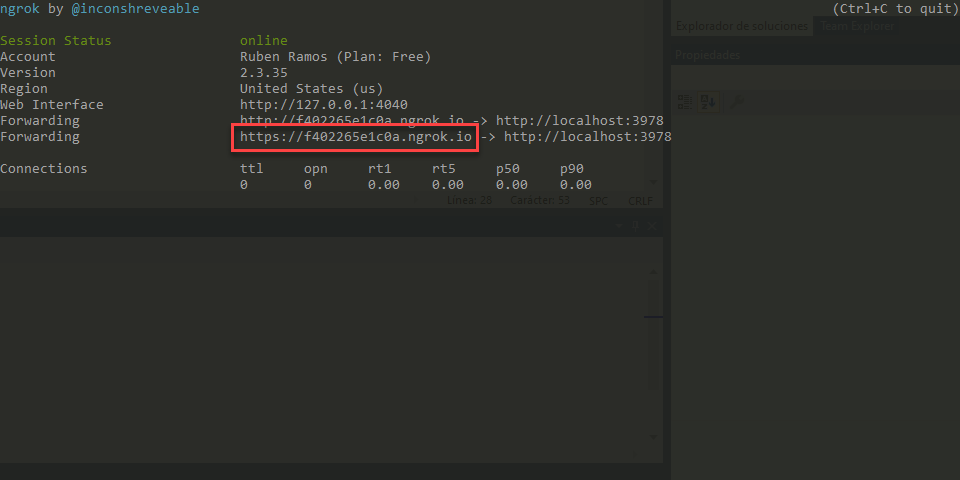

# Ejecutar la aplicación ngrok
Para este laboratorio vamos a utilizar ngrok para poder publicar una url y que el bot que pueda hacer las llamadas al servicio que vamos a crear. Si no lo tienes puedes descargarlo desde [aqui](https://ngrok.com/).

Una vez descargado ejecuta los siguientes pasos para ejecutarlo:

1. Abre una nueva ventana del símbolo del sistema

1. Cambia al directorio que contiene la aplicación ngrok.exe

1. Al crear la solución con Visual Studio por defecto le asigna el puerto 3978, puedes comprobarlo dentro de las propiedades del proyecto, en la pestaña Depurar

    

1. Ejecute el siguiente comando reemplazando [port] con el puerto de la URL de la aplicación

    ```code 
    ngrok http -host-header=rewrite [port] 
    ```

    


1. La aplicación ngrok mostrará en la consola información. Tome nota de la dirección de reenvío utilizando https. Esta dirección es necesaria en los siguientes pasos.

1. Puedes minimizar la ventana de la línea de comandos de ngrok, pero debe seguir funcionando.
1. Ten en cuenta que cada vez que arranques ngrok, te asignará un nuevo dominio (a no ser que tengas una cuenta de pago), por lo que cada vez que lo ejecutes tendrás que cambiar la url del servicio en el registro del bot en Azure.