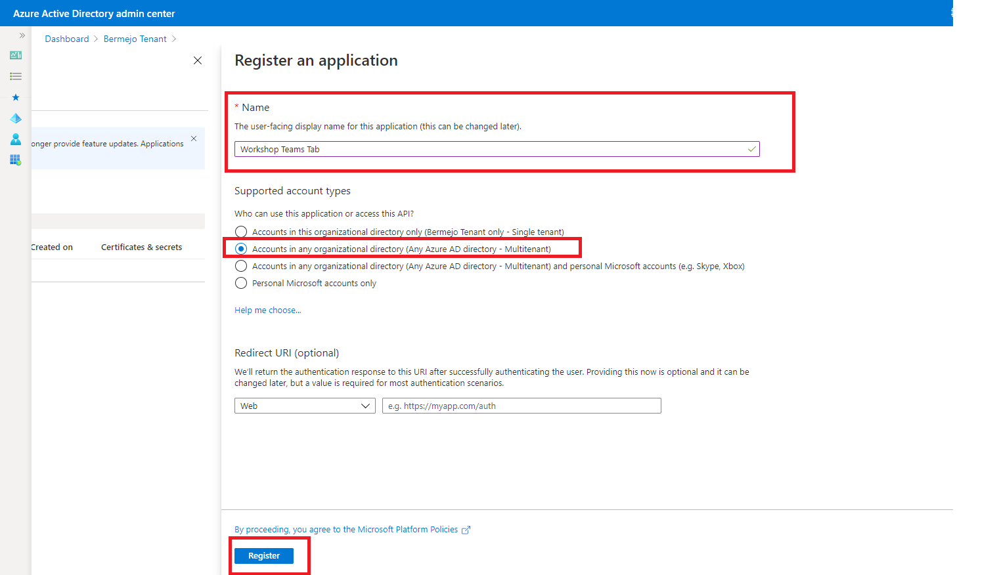
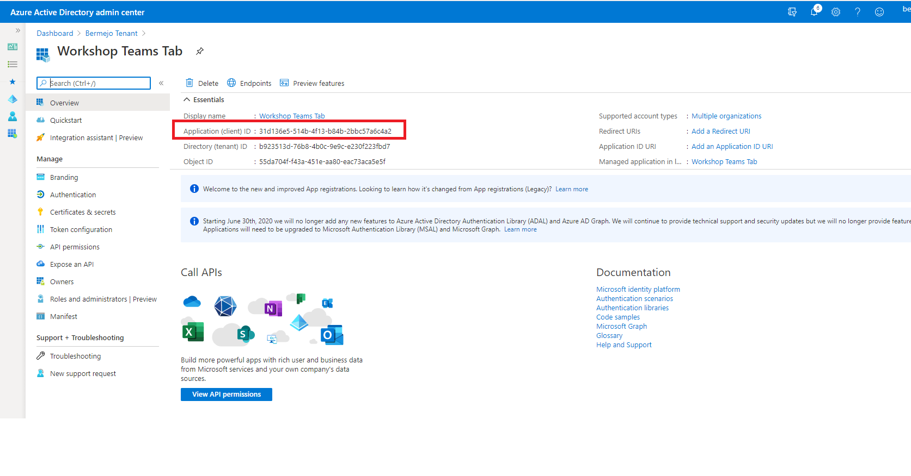
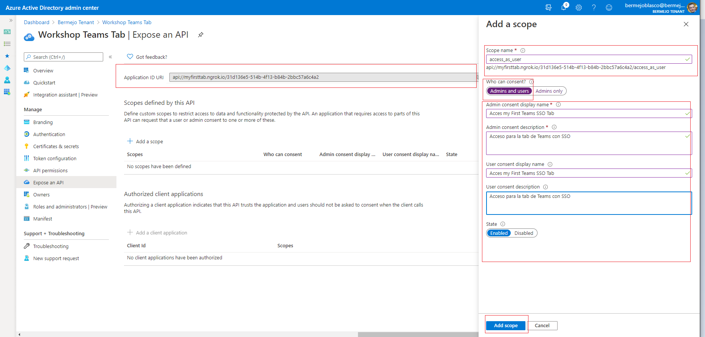
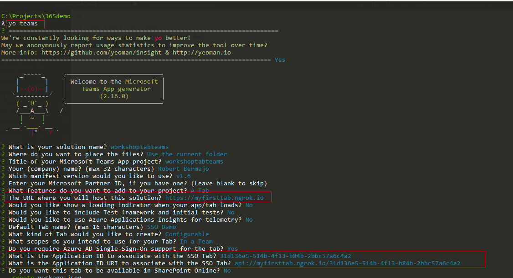
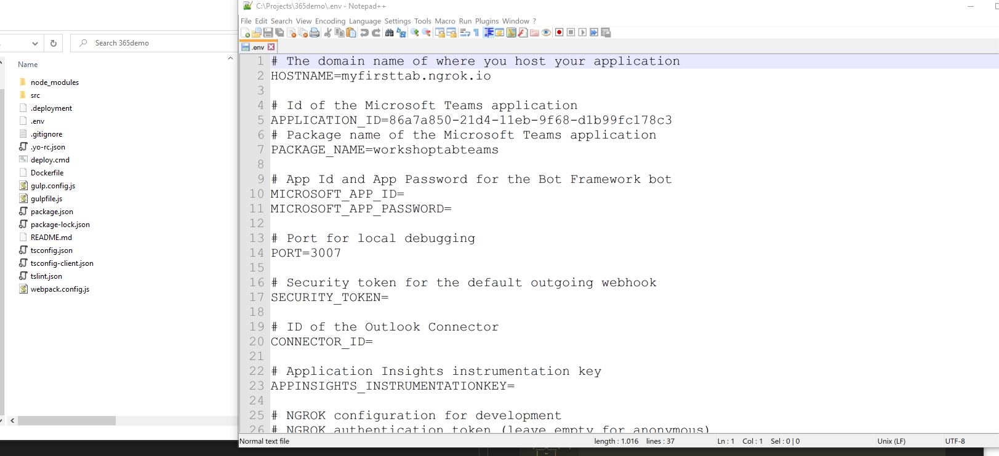

# Ejercicio 1 : Utilizar yeoman de Teams 

En Este tutorial aprenderás los pasos necesarios y la configuración que necesitas en Azure Active Directory y en Microsoft Teams para usr SSO en Microsoft Teams Tab. 

## Configurando una aplicación en Azure AD  

1- Hacemos login en [https://aad.portal.azure.com ](https://aad.portal.azure.com)  
2- Añadimos una nueva aplicación  
  
3- Creamos la aplicación con las siguientes caracteristicas:  
- Name: **Workshop Teams Tab**  
- En la seccción *Supported account types* seleccionamos *Accounts in any organizational directory (Any Azure AD directory - Multitenant)*  
- Le damos al botón *Register*  

  

4- Una vez creada copiamos el *Application (client) ID* en un bloc de notas ya que lo necesitaremos más adelante  

  

5- Ahora a está aplicación le configuraremos los permisos que tendrá de acceso dentro de nuestro tenant. Para ello.
- Daremos click en la seccción *Expose an API*  
  
- En la primer pantalla que nos mostrará debemos poner el nombre del dominos (FQDN) se se usará en la tab y a continuación rellenamos los campos con en la figura:  
  
- En nuestro caso el FQDN que hemos pueto es *myfirsttab.ngrok.io* ya que usaremos ngrok en este lab. 
- Ahora le daremos acceso a las aplicaciones de Teams, tanto mobile como desktop:  
  - 1fec8e78-bce4-4aaf-ab1b-5451cc387264 - the ID used by the Microsoft Teams desktop and mobile application  
  -  5e3ce6c0-2b1f-4285-8d4b-75ee78787346 - the ID use by the Microsoft Teams web application  
  
    

Ahora estamos listos para generar nuestro projecot para la tab en Teams.  

## Generando el proyecto  

1- Abrimos una consola y lanzamos yeoman: **yo teams**   
2- Seleccionamos la versión 1.6  
3- Consideracion:  
- Necesitamos una URL para nuestro host, en nuestro caso: *https://myfirsttab.ngrok.io*  
- El application Id que hemos guardado antes
- Y el application Id URI que se ha generado antes también  

La configuración de la creación del proyecto quedaría de la siguiente forma:  
  

Toda esta configuración se puede canvair luego en el fichero .env  
  

4- Ahora ejecutmaos el comando gulp ngrok-serve. Esto solo irá si tienes ngrock de pago, sino lo tienes haremos un workarround en vivo.    
5- El paso anterior nos ha generado un zip con el manifest que es lo que debemos subir a nuestro teams (./package/<manifest>.zip)  
6- En Teams en el apartado apps, seleccionar añadir app y subir el zip anterior  
7- Ir a un chanel de Teams y añadir la tab  

El resultado sería este:  
  

¡Y esto es todo amigos!
